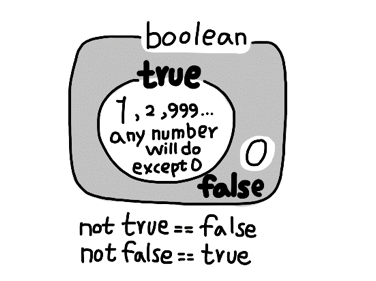

# Python 기초

## 컴퓨터 프로그래밍 언어

### 컴퓨터(Computer)

> Caculation + Remember

### 프로그래밍(programming)

> 명령어의 모음(집합)

### 언어

> 자신의 생각을 나타내고 전달하기 위해 사용하는 체계
>
> 문법적으로 맞는 말의 집합 -> 컴퓨터에게 명령하는 말

- 선언적 지식(declarative knowledge) : 사실에 대한 내용
- 명령적 지식(imperative knowledge) : How-to

## Python 이란?

- Easy to learn
  - 다른 프로그래밍 언어보다 문법이 간단하면서도 엄격하지 않음
    - 예시 : 변수에 별도의 타입 지정이 필요없음 (동적 타이핑 언어)
  - 문법 표현이 매우 간결하여 프로그래밍 경험이 없어도 짧은 시간 내에 마스터 할 수 있음
- Expressive Language
  - 같은 작업에 대해서도 C나 자바로 작성할 때보다 더 간결하게 작성 가능
  - 크로스 플랫폼 언어
    - Windows, macOS, Linux, Unix 등 다양한 운영체제에서 실행 가능
- 인터프리터 언어(Interpreter)
  - 소스코드를 기계어로 변환하는 컴파일 과정없이 바로 실행 가능
  - 코드를 대화하듯 한 줄 입력하고 실행한 후, 바로 확인할 수 있음
- 객체 지향 프로그래밍(Object Oriented Programming)
  - 파이썬은 객체지향 언어이며, 모든 것이 객체로 구현되어 있음
    - 객체(object) : 숫자, 문자, 클래스 등 값을 가지고 있는 모든 어떠한 것

## Python Environment

파이썬 기본 인터프리터 : IDLE

- IDLE (Intergrated Development and Learning Environment)
  - 내장 프로그램으로 파이썬 설치 시 기본적으로 설치 -> 인터프리터가 대화형 모드로 동작함
    - 여러 줄의 코드가 작성되는 경우 보조 프롬프트가 사용됨
    - 프롬프트에 코드를 작성하면 해당 코드가 실행됨
  - Python이 설치된 환경에서는 기본적으로 활용 가능하나 디버깅 및 코드 편집, 반복 실행이 어려움

## Python 기초 문법

### 코드 스타일 가이드

- 코드를 ''어떻게 작성할지''에 대한 가이드라인

- 파이썬에서 제안하는 스타일 가이드
  - [PEP8](https://peps.python.org/pep-0008/)

- 기업, 오픈소스 등에서 사용되는 스타일 가이드
  - [Google Style guide](https://google.github.io/styleguide/pyguide.html)

### 들여쓰기(Identation)

- Space Sensitive
  - 문장을 구분할 때, 들여쓰기(indentation)를 사용
  - 들여쓰기 할때는 띄어쓰기 4칸 혹은 tab 1번

### 변수(Variable)

> 컴퓨터 메모리 어딘가에 저장되어 있는 객체를 참조하기 위해 사용되는 이름

- 객체 (object) : 숫자, 문자, 클래스 등 값을 가지고 있는 모든 것
- 파이썬은 객체지향 언어이며, 모든 것이 객체로 구현되어 있음

- 동일변수에 다른 객체를 언제든 할당할 수 있기 때문에, 즉 참조하는 객체가 바뀔 수 있기 때문에 '변수'라고 불림
- 변수는 할당 연산자(=)를 통해 값을 할당 (assignment)
- type()
  - 변수에 할당된 값의 타입
- id()
  - 변수에 할당된 값(객체)의 고유한 아이덴티티(identity) 값이며, 메모리주소
- 변수 연산 가능

```python
s = '파이썬'
print(s * 3)
print(s + 'is fun')

# 파이썬파이썬파이썬
# 파이썬 is fun
```

```python
# 연습 문제
# x = 10, y = 20 일 때, 각각 값을 바꿔서 저장하는 코드를 작성하시오.

x, y = 10, 20

# 1
tmp = x
x = y
y = tmp
print(x,y)
# 2
y, x = x, y
print(x, y)
```

### 식별자(Identifiers)

- 파이썬 객체(변수, 함수, 모듈, 클래스 등)를 식별하는데 사용하는 이름(name)
- 규칙
  - 식별자의 이름은 영문 알파벳, 언더스코어(_), 숫자로 구성
  - 첫 글자에 숫자 안됨
  - 길이제한 없음 대소문자 구별함
- 내장함수나 모듈 등의 이름으로도 만들면 안됨
  - 기존의 이름에 다른 값을 할당하게 되므로 더 이상 동작하지 않음

### 사용자 입력

- input([prompt])
  - 사용자로부터 값을 입력받을 수 있는 내장함수
  - 항상 문자열의 형태로 반환


``` python
name = input('이름을 입력해주세요 : ')
print(name)
# 이름을 입력해주세요 : 파이썬
type(name)
# str
```

### 주석(Comment)

- 코드에 대한 설명
  - 중요한 점이나 다시 확인해야 하는 부분 표시
  - 컴퓨터는 주석을 인식하지 않음 사용자만을 위한 것
- 가장 중요한 습관
  - 개발자에게 주석을 작성하는 습관은 매우 중요
  - 쉬운 이해와 코드의 분석 및 수정 용이
    - 주석은 코드 실행에 영향을 미치지 않을 뿐만 아니라 프로그램의 속도를 느리게 하지 않고 용량을 늘리지 않음

- 한 줄 주석
  - 주석으로 처리될 내용 앞에 `#` 입력
  - 단축키 `Ctrl + /`

## Python 기본 자료형 (Datatype)

### 자료형 분류

- 불린형 (Boolean Type)
  - True / False 값을 가진 타입
  - 비교 / 논리 연산 수행
  - `bool()` 함수
  - 0, 0.0, (), []. {}, ", None 을 False로 변환
  
  
  
- 수치형 (Numeric Type)
  - int (정수, integer)
  - float (부동소수점, 실수, floating point number)
  - complex (복소수, complex number)
  
- 문자형

- None
  - 파이썬에서 값이 없음을 표현하기 위해 None 타입이 존재함
  - 일반적으로 반환 값이 없는 함수에서 사용하기도 함

```python
print(type(None))
# <class 'NonType'>
a = None
print(a)
# None
```


연산자 (Operator)

논리 연산자 (Logical Operator)

논리식을 판단하여 True False를 반환함

수치형(Numeric Type)

정수 (Int)

모든 정수의 타입은 int

매우 큰수를 나타낼 때 오버플로우가 발생하지 않음

실수 (Float)

정수가 아닌 모든 실수는 float 타입

부동소수점

실수를 컴퓨터가 표현하는 방법 - 2진수(비트)로 숫자를 표현

이 과정에서 floating point rounding error가 발생하여, 예상치 못한 결과가 발생

Floating point rounding error

부동소수점에서 실수 연산 과정에서 발생 가능

값 비교하는 과정에서 정수가 아닌 실수 인 경우 주의할 것 

```python
# 아래는 참일까? 거짓일까?
3.14 - 3.02 == 0.12

3.14 - 3.02
# 0.12000000000001
```

복소수(Complex)

실수부와 허수부로 구성된 복소수는 모두 complex 타입

허수부를 j로 표현

산술 연산자 (Arithmetic Operator)

- 기본적인 사칙연산 및 수식 계산

| 연산자 |   내용   |
| :----: | :------: |
|   +    |   덧셈   |
|   -    |   뺄셈   |
|   *    |   곱셈   |
|   %    |  나머지  |
|   /    |  나눗셈  |
|   //   |    몫    |
|   **   | 거듭제곱 |

나머지 -> 짝수 홀수 가릴때 많이 쓴댜... 2로나눴을때 나머지가 0 이냐 1이냐..

3의배수? 3으로 나눴을때 나머지가 0인것

복합연산자 (In-place Operator)

연산과 할당이 함께 이뤄짐

비교 연산자(Comparison Operator)

문자열 (String Type)

삼중따옴표 (Triple Quotes)

작은 따옴표나 큰 따옴표를 삼중으로 사용

따옴표 안에 따옴표를 넣을 때

여러줄을 나눠 입력할 때

형 변환 (Typecasting)

자료형 변환 (Typecasting)

파이썬에서 데이터 형태는 서로 변환할 수 있음

암시적 형 변환 (Implict)

bool (True = 1)

명시적 형 변환 ()

컨테이너 (Container)

- 컨테이너란 여러개

시퀀스

- 문자열 (immutable) : 문자들의 나열

- 리스트 (mutable) : 변경 가능한 값들의 나열

- 튜플 (immutable) : 변경 불가능한 값들의 나열

- 레인지 (immutable) : 숫자의 나열

컬렉션/비시퀀스

- 세트 (matable) : 유일한 값들의 모음

- 딕셔너리 (mutable) : 키-값들의 모음

리스트(List) 정의

- 변경 가능한 값들의 나열된 자료형
- 순서를 가지며, 서로 다른 타입의 요소를 가질 수 있음
- 변경 가능하며(mutable), 반복 가능함(iterable)
- 항상 대괄호 형태로 정의하며, 요소는 콤마로 구분

코딩폰트 - D2Coding, hack

생성과 접근

소괄호 혹은

레인지 (Range)

슬라이싱이랑 닮음

세트(Set) - 순서가 없음

중괄호 ({}) 혹은 set() 

값 추가 - .add()

값 삭제 - .remove()

세트로 활용하면 다른

```python
# 활용 예시
locations = ['서울','서울','대구','제주','부산','부산','광주','인천']
print(set(locations))

# {'부산','인천','서울','대구','제주','광주'}
```

딕셔너리 (Dictionary)

- 키 - 값 (key - value) 쌍으로 이뤄진 모음 (collection)
  - 키 (key)
    - 불변 자료형만 가능 (리스트, 딕셔너리 등은 불가능함)

키는 문자열이고, (리스트 들어갈수 없음, 튜플은 가능)

key에 리스트를 넣는 경우는 없고 value에 리스트를 넣는 경우는 많음

딕셔너리도 순서가 없다.

키와 값의 쌍을 추가할 수 있으며..

.pop() : 키-값 삭제

키가 없는 경우 : KeyError


input은 모두 string으로 저장되기 때문에 숫자로 활용하기 위해서는 항상 int로 변환

```python
num = input()
print(int(num)+5)
```

`\n` : 줄바꿈

`\` : 무효화
