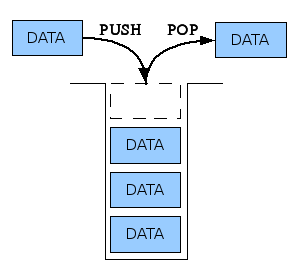
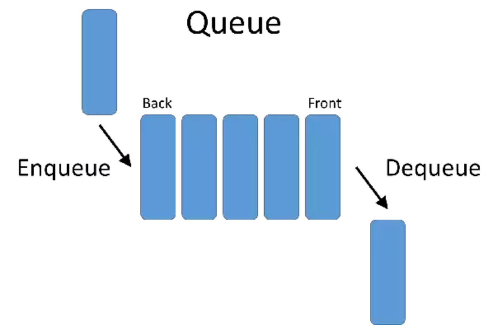
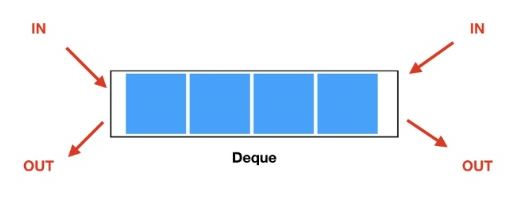

# 스택 (Stack)

- 쌓는다는 의미로써, 마치 접시를 쌓고 빼듯이 **데이터를 한쪽에서만 넣고 빼는 자료구조**

- 가장 마지막에 들어온 데이터가 가장 먼저 나가므로 **LIFO(Last-in First-out, 후입선출)** 방식



- 파이썬은 **리스트**로 스택을 간편하게 사용할 수 있다! (`pop()`, `append()`)

## Use case

### 뒤집기, 되돌리기, 되돌아가기

- 브라우저 뒤로가기
- ctrl + z
- 단어 뒤집기

### 마무리되지 않은 일을 임시 저장

- 괄호 매칭
- 함수 호출
- 백트래킹
- DFS (깊이 우선 탐색)

### 연습문제

- [백준 10773](https://www.acmicpc.net/problem/10773)

```python
K = int(input())
stack = []

for i in range(K):
    N = int(input())
    if N != 0:
        stack.append(N)
    else:
        stack.pop()

print(sum(stack))
```

# 큐 (Queue)

- **한쪽 끝에서 데이터를 넣고, 다른 한 쪽에서만 데이터를 뺄 수 있는 자료구조**

- 가장 먼저 들어온 데이터가 가장 먼저 나가므로 **FIFO(First-in First-out, 선입선출)** 방식



- 파이썬은 **리스트**로 큐 자료구조를 간편하게 사용할 수 있다! (`pop(0)`, `append()`)

### 연습문제

- [백준 2161](https://www.acmicpc.net/problem/2161)

```python
N = int(input())
queue = list(range(1, N + 1))

while len(queue) > 1:
    print(queue.pop(0), end=" ")
    queue.append(queue.pop(0))

print(queue[0])
```

### 리스트를 이용한 큐 자료구조의 단점

- 데이터를 뺄 때 큐 안에 있는 데이터가 많은 경우 비효율적이다
- 맨 앞의 데이터가 빠지면서, 리스트의 인덱스가 하나씩 당겨지기 때문

### 덱(Deque, Double-Ended Queue) 자료구조

> **양방향**으로 삽입과 삭제가 자유로운 큐



- 덱은 양 방향 삽입, 추출이 모두 큐보다 훨씬 빠름
- 따라서 데이터의 삽입, 추출이 많은 경우에 시간을 크게 단축 시킬 수 있다

- [백준 2161](https://www.acmicpc.net/problem/2161) - 덱을 이용한 풀이

```python
from collections import deque

n = int(input())
queue = deque(range(1, n + 1))

while len(queue) > 1:
    print(queue.popleft(), end=' ')
    queue.append(queue.popleft())
    
print(queue[0])
```