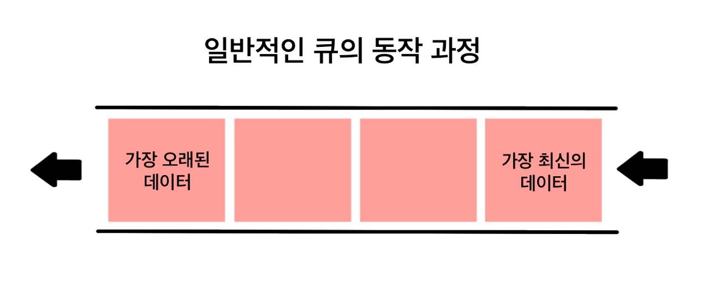
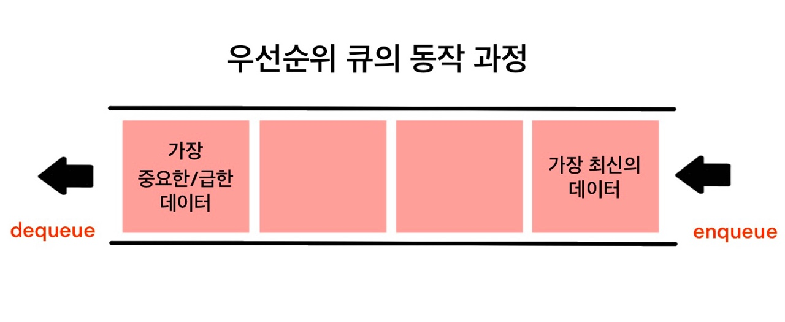
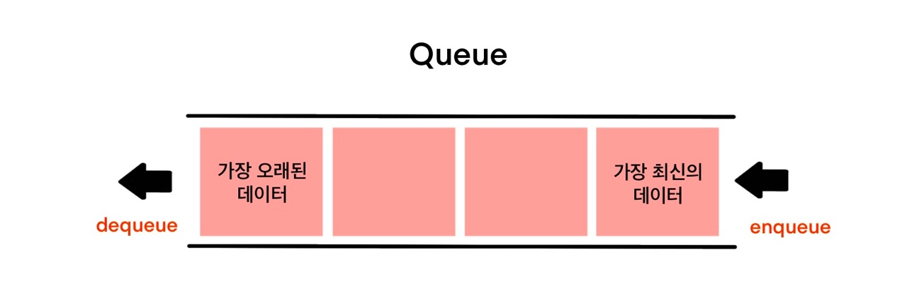
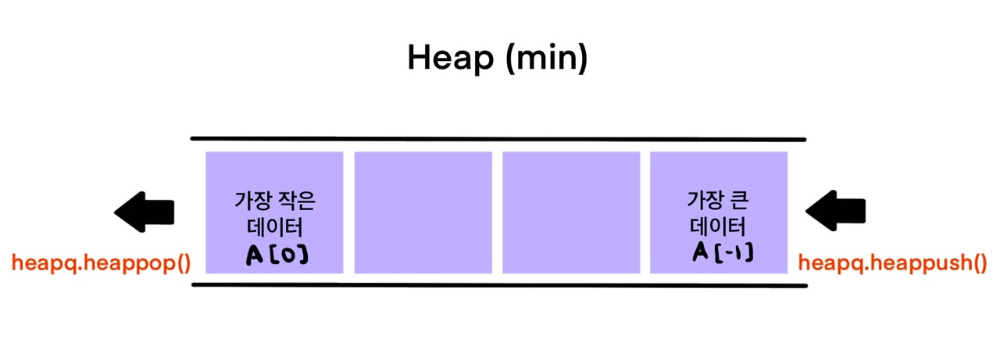

# 힙 (Heap)

- 우선순위 큐로 활용할 수 있는 데이터구조

- **최대값 또는 최소값**을 빠르게 찾아내도록 만들어진 데이터구조
- 완전 이진 트리의 형태로 **느슨한 정렬 상태를 지속적으로 유지**한다 ===> 최대 최소값만 맨 앞으로 정렬한다
- 힙 트리에서는 중복 값을 허용한다

## 우선순위 큐 (Priority Queue)

- 우선순위 큐(Priority Queue)는 **우선순위(중요도, 크기 등 순서 이외의 기준)를 기준**으로 가장 우선순위가 높은 데이터가 가장 먼저 나가는 방식





- 순서가 아닌 우선순위를 기준으로 가져올 요소를 결정(dequeue)하는 큐
  - 가중치가 있는 데이터
  - 작업 스케줄링
  - 네트워크

### 우선순위 큐 구현 방법

- 배열 (Array)
- 연결 리스트 (Linked List)
- **힙 (Heap)**

### 우선순위 큐 구현 별 시간 복잡도

| 연산 종류                | Enqueue(추가) | Dequeue(출력) |
| :----------------------- | :-----------: | :-----------: |
| 배열(Array)              |     O(1)      |     O(N)      |
| (정렬된 배열)            |     O(N)      |     O(1)      |
| 연결리스트 (Linked List) |     O(1)      |     O(N)      |
| (정렬된 연결리스트)      |     O(N)      |     O(1)      |
| **힙(Heap)**             |  **O(logN)**  |  **O(logN)**  |

## Use Case

- 데이터가 지속적으로 정렬되어야 하는 경우
- 데이터에 삽입/삭제가 빈번할 경우

## 파이썬의 heapq 모듈

- Minheap(최소 힙)으로 구현되어 있음 (가장 작은값이 먼저 옴)
- 삽입, 삭제, 수정, 조회 연산의 속도가 리스트보다 빠르다
- 배열, 연결리스트, 힙으로 구현 가능

## 힙 VS 리스트

|  연산 종류  | 힙(Heap) |  리스트(List)  |
| :---------: | :------: | :------------: |
|  Get item   |   O(1)   |      O(1)      |
| Insert item | O(logN)  | O(1) 또는 O(N) |
| Delete item | O(logN)  | O(1) 또는 O(N) |
| Search item |   O(N)   |      O(N)      |

## 큐와 힙의 사용법 비교





## 메소드

- `heapq.heapify()`
- `heapq.heappop(heap)`
- `heapq.heappush(heap, item)`

```python
import heapq

numbers = [5, 3, 2, 4, 1]
heapq.heapify(numbers) # numbers 리스트를 힙으로 만듦
heapq.heappop(numbers) # 최소값 빼기

print(numbers)
# [2, 3, 5, 4]

heapq.heappush(numbers, 10)
heapq.heappush(numbers, 0)
print(numbers)
# [0, 3, 5, 10, 4]
```

### 연습문제

- [백준 1927 : 최소 힙](https://www.acmicpc.net/problem/1927)

```python
import heapq

N = int(input())
haep = []

for _ in range(N):
    n = int(input())
    if number != 0:
        heapq.heappush(heap, n)
    else:
        if len(heap) == 0:
            print(0)
        else:
        	print(heapq.heappop(heap))
```

- [백준 11286 : 절대값 힙](https://www.acmicpc.net/problem/11286)

```python
import sys
import heapq

numbers = []
N = int(input())

for i in range(N):
    n = int(sys.stdin.readline())
    if n != 0:
        heapq.heappush(numbers, (abs(n), n))
    else:
        if len(numbers) == 0:
            print(0)
        else:
            print(heapq.heappop(numbers)[1])
```

# 셋 (Set)

> **set는 수학에서의 집합을 나타내는 데이터구조**로 python에서 기본적으로 제공되는 데이터구조

- 중복된 원소가 없음 (중복된 원소를 가질 수 없음)
- 원소 간의 순서가 없음 ===> 인덱스 번호로 원소를 읽을 수 없음
- 집합간의 연산을 통해 교집합/합집합/차집합을 구할 수 있음

## Use Case

- 데이터의 중복이 없어야 할 때 (고유값들로 이루어진 데이터가 필요할 때)
- 정수가 아닌 데이터의 삽입/삭제/탐색이 빈번히 필요할 때

## Set 연산

- `.add()` : 원소 한개 추가
- `.remove()` : 원소 한개 삭제
- `.update()` : 여러개 원소 추가

```python
a = set([4, 1, 2, 3])
a.add(5)
print(a) # {1, 2, 3, 4, 5}

a.remove(5)
print(a) # {1, 2, 3, 4}

a.update([10, 11, 12])
print(a) # {1, 2, 3, 4, 10, 11, 12}
```

- `|` : 합집합
- `-` : 차집합
- `&` : 교집합
- `^` : 대칭차

```python
a = set([1, 2, 3, 4])
b = set([4, 5, 6])

합 = a | b
print(합) # {1, 2, 3, 4, 5, 6}

교 = a & b
print(교) # {4}

차 = a - b
print(차) # {1, 2, 3}
```

## Set 연산의 시간 복잡도

|  연산 종류  | 시간복잡도 |
| :---------: | :--------: |
|    탐색     |    O(1)    |
|    제거     |    O(1)    |
|   합집합    |    O(N)    |
|   교집합    |    O(N)    |
|   차집합    |    O(N)    |
| 대칭 차집합 |    O(N)    |

### 연습문제

- [백준 14425 : 문자열 집합](https://www.acmicpc.net/problem/14425)

```python
# 풀이1
S = []
words = []

for word in words:
    if word in S:
        cnt += 1
        
print(cnt)

# 풀이2
print(len(set(words) & set(S))
```

- [백준 1269 : 대칭 차집합](https://www.acmicpc.net/problem/1269)

```python
A, B = map(int, input().split())
A_set = set(map(int, input().split()))
B_set = set(map(int, input().split()))

print(len((A_set - B_set) | (B_set - A_set)))
```

