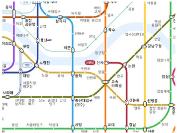
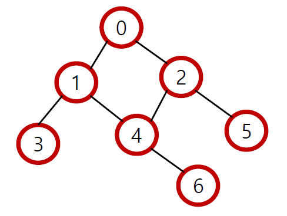
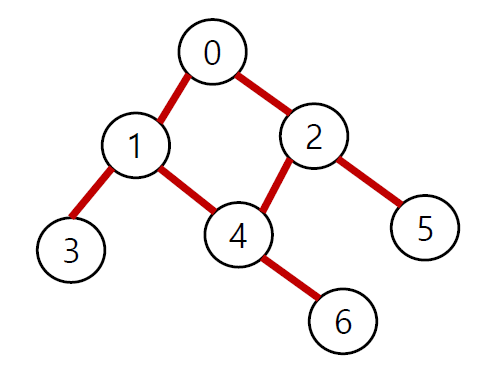
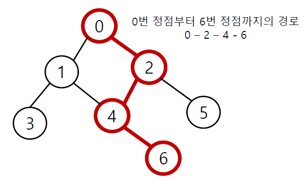
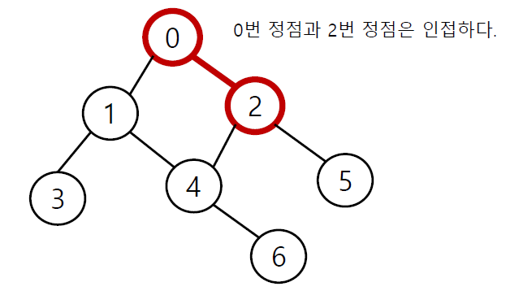
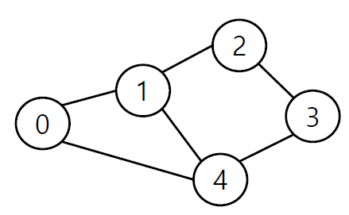
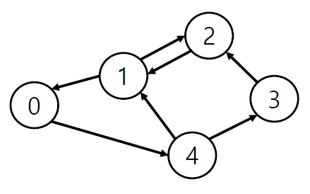
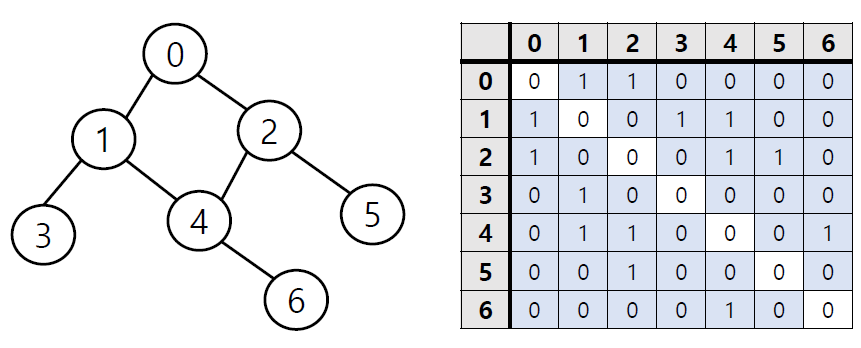
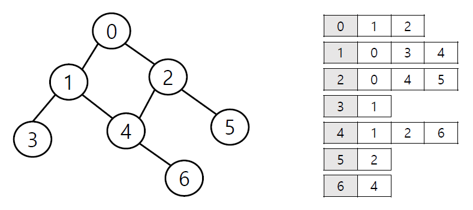

# 그래프 (Graph)

> 정점(Vertex)과 이를 연결하는 간선(Edge)들의 집합으로 이루어진 비선형 자료구조

- 소셜 네트워크와 지하철 노선도 같이 현실에 있는 개체간의 관계를 나타내기 위해 사용한다



- 여러가지 순회 루트가 있다

## 그래프 관련 용어

- **정점(Vertex)** : 간선으로 연결되는 객체이며, 노드(Node)라고도 한다.



- **간선(Edge)** : 정점 간의 관계(연결)을 표현하는 선



- **경로(Path)** : 시작 정점부터 도착 정점까지 거치는 정점을 나열한 것



- **인접(Adjacency)** : 두개의 정점이 하나의 간선으로 직접 연결된 상태



## 그래프의 종류

### 무방향 그래프 (Undirected graph)



- 간선의 **방향이 없는** 가장 일반적인 그래프
- 간선을 통해 양방향의 정점 이동 가능
- **차수(Degree)** : 하나의 정점에 연결된 간선의 개수
- 모든 정점의 차수의 합 == 간선 수 X 2

### 유방향 그래프 (Directed graph)



- 간선의 **방향이 있는** 그래프
- 간선의 방향이 가리키는 정점으로 이동 가능
- **차수(Degree)** : 진입 차수와 진출 차수로 나누어짐
  - 진입 차수(In-degree) : 외부 정점에서 한 정점으로 들어오는 간선의 수
  - 진출 차수(Out-degerr) : 한 정점에서 외부 정점으로 나가는 간선의 수

## 그래프의 표현

```python
graph = {
    0: [1, 2],
    1: [0, 3, 4],
    2: [0, 4, 5],
    3: [1],
    4: [1, 2, 6],
    5: [2],
    6: [4]
}
# graph[0][0] => 1

graph = [
    [1, 2],
    [0, 3, 4],
    [0, 4, 5],
    [1],
    [1, 2, 6],
    [2],
    [4]
]
# graph[0][0] => 1

subway = {
    'yeoksam': ['gangnam', 'seonleung'],
    'seonleung': ['yeoksam', 'samsung', 'sunjeongleung', 'hanti']
}
```

### 인접 행렬 (Adjacent matrix)

> 두 정점을 연결하는 **간선이 없으면 0, 있으면 1을 가지는 행렬**로 표현하는 방식



```python
# 입력(연결된 정점)
0 1
0 2
1 3
1 4
2 4
2 5
4 6

edges = [
    [0, 1],
    [0, 2],
    [1, 3],
    [1, 4],
    [2, 4],
    [2, 5],
    [4, 6]
]

# 인접 행렬 만들기
n = 7 # 정점 개수
m = 7 # 간선 개수

graph = []
for _ in range(n):
    graph.append([0] * n)

# 컴프리헨션
graph = [[0] * n for _ in range(n)]

for _ in range(m):
    v1, v2 = map(int, input().split())
    graph[v1][v2] = 1
    graph[v2][v1] = 1
    
# 인접 행렬 결과
graph = [
    [0, 1, 1, 0, 0, 0, 0],
	[1, 0, 0, 1, 1, 0, 0],
    [1, 0, 0, 0, 1 ,1, 0],
    [0, 1, 0, 0, 0, 0, 0],
    [0, 1, 1, 0, 0, 0, 1],
    [0, 0, 1, 0, 0, 0, 0],
    [0, 0, 0, 0, 1, 0, 0]
]
```

### 인접 리스트 (Adjacent list)

> **리스트**를 통해 각 정점에 대한 인접 정점들을 **순차적**으로 표현하는 방식



```python
# 입력(연결된 정점)
0 1
0 2
1 3
1 4
2 4
2 5
4 6

# 인접 리스트 만들기
n = 7 # 정점 개수
m = 7 # 간선 개수

graph = [[] for _ in range(n)]

for _ in range(m):
    v1, v2 = map(int, input().split())
    graph[v1].append(v2)
    graph[v2].append(v1)
    
# 인접 리스트 결과
# 인덱스 번호가 정점의 번호를 의미
graph = [		
    [1, 2],		# 0
    [0, 3, 4],	# 1
    [0, 4, 5],	# 2
    [1],		# 3
    [1, 2, 6],	# 4
    [2],		# 5
    [4]			# 6
]
```

### 인접 행렬 vs 인접 리스트

- **인접 행렬**은 직관적이고 만들기 편하지만, 불필요하게 공간이 낭비됨
- **인접 리스트**는 연결된 정점만 저장하여 효율적이므로 자주 사용됨
