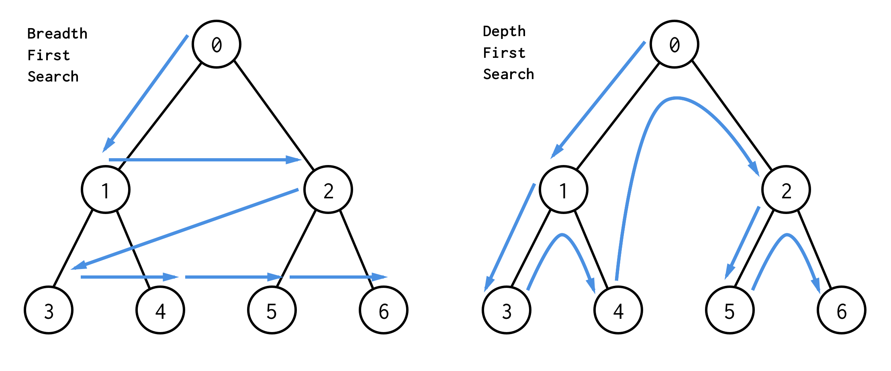

# 그래프 탐색 알고리즘

> 시작 정점에서 **간선을 타고 이동할 수 있는 모든 정점을 찾는** 알고리즘



## 깊이우선탐색 (Depth-First Search, DFS)

> 시작 정점으로부터 **갈 수 있는 하위 정점까지 가장 깊게 탐색**하고, 더 이상 갈 곳이 없다면 마지막 갈림길로 돌아와서 다른 정점을 탐색하며 결국 모든 정점을 방문하는 순회 방법

- 그래프의 깊이를 우선으로 탐색하기 위해 **스택**을 활용한다
- 미로 탈출과 같다. 어느 한 쪽 길로 가장 깊게 들어갔다가 막히면 다시 돌아와서 다른 길을 탐색한다

### DFS 특징

- **모든 정점을 방문**할 때 유리함
- **경우의 수, 순열과 조합** 문제에서 많이 사용됨
- 너비우선탐색(BFS)에 비해 코드 구현이 간단함
- 하지만 모든 정점을 방문할 필요가 없거나 최단 거리를 구하는 경우에는 너비우선탐색(BFS)이 유리함

### DFS 동작 과정

- DFS 를 하기 전에 탐색할 그래프가 필요함

- **인접 리스트**를 사용하는 것이 효율적

- 각 정점을 방문했는지 확인할 **체크리스트** 필요

  - visited 리스트를 따로 선언하여 체크한다

  ```python
   # n = 정점의 개수
  visited = [False] * n
  visited = [0] * n
  ```

  - 방문한 정점은 True (1), 방문하지 않은 정점은 False (0) 처리

- **DFS의 사이클**

  1.  현재 정점 방문처리
  2.  인접한 모든 정점 확인
  3.  방문하지 않은 인접 정점 이동

### DFS 구현 방식

- DFS는 직전에 방문한 정점으로 차례로 돌아가야 하므로, 후입선출(LIFO) 구조의 **스택**을 이용한다.

```python
graph = [
    [1, 2],
    [0, 3, 4],
    [0, 4, 5],
    [1],
    [1, 2, 6],
    [2],
    [4]
]
visited = [False] * n	# 방문 체크리스트

visited[start] = True	# 시작 정점 방문 처리
stack = [start]			# 돌아갈 곳 기록 = stack

# 스택이 빌 때까지(돌아갈 곳이 없을 떄까지) 반복
while len(stack) ! = 0:  # while stack: 과 같음
    cur = stack.pop()	
    for adj in graph[cur]:
        if not visited[adj]:
            visited[adj] = True
            stack.append(adj)

# 함수
def dfs(start):
    stack = [start]
    visited[start] = True
    
    while stack:
        cur = stack.pop()
        
        for adj in graph[cur]:
            if not visited[ad]:
                visited[adj] = True
                stack.append(adj)
dfs(1) # 1번 정점에서 시작  
```

### 연습 문제

[BOJ 2606: 바이러스](https://www.acmicpc.net/problem/2606)

```python
n = int(input())
m = int(input())
graph = []
# 문제의 인덱스가 1부터 시작하기 때문에 n + 1
for _ in range(n + 1):
    graph.append([])
visited = [0] * (n + 1)
total = 0

# 인접 리스트
for _ in range(m):
    v1, v2 = map(int, input().split())
    graph[v1].append(v2)
    graph[v2].appned(v1)

graph = [
    [],
    [2, 5],
    [1, 3, 5],
    [2],
    [7],
    [1, 2, 6],
    [5],
    [4]
]

stack = [1]
visited[1] = True

while stack:
    cur = stack.pop()

    for adj in graph[cur]:
        if not visited[adj]:
            visited[adj] = True
            stack.append(adj)
```

## 너비우선탐색 (Breadth-First Search, BFS)

- 그래프의 너비를 우선으로 탐색하기 위해 **큐**를 활용한다
- 최단거리 찾을 때 사용

## DFS vs BFS
