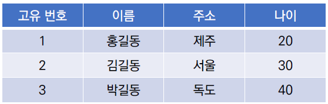
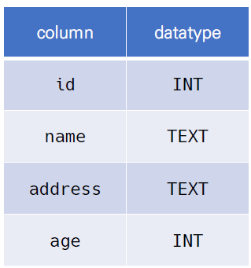
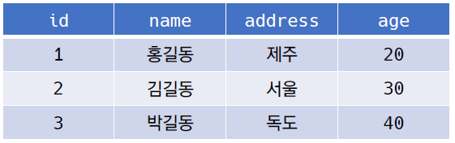

# Database

- **체계화된 데이터**의 모임
- 여러 사람이 공유하고 사용할 목적으로 통합 관리되는 정보의 집합
- 논리적으로 연관된 (하나 이상의) 자료의 모음으로 그 내용을 고도로 구조화 함으로써 검색과 갱신의 효율화를 꾀한 것
- **몇 개의 자료 파일을 조직적으로 통합하여 자료 항목의 중복을 없애고 자료를 구조화하여 기억시켜 놓은 자료의 집합체**

### 데이터베이스로 얻는 장점들

- 데이터 중복 최소화
- 데이터 무결성 (정확한 정보를 보장)
- 데이터 일관성
- 데이터 독립성 (물리적 / 논리적)
- 데이터 표준화
- 데이터 보안 유지

## RDB (Relational Database)

- **관계형 데이터베이스 (RDB, Relational Database)**
  - 서로 관련된 데이터를 저장하고 접근할 수 있는 데이터베이스 유형
  - 키(key)와 값(value)들의 간단한 관계(relation)를 표(table) 형태로 정리한 데이터베이스

- **스키마 (schema)**
  - 데이터베이스에서 자료의 구조, 표현 방법, 관계 등 전반적인 **명세를 기술**한 것

- **테이블 (table)**
  - 열(컬럼/필드)과 행(레코드/값)의 모델을 사용해 조직된 데이터 요소들의 집합
  - 열 (column) : 각 열에 고유한 데이터 형식 지정
    - 아래 예시에서는 name이라는 필드에 고객의 이름 정보가 TEXT로 저장됨
  - 행 (row) : 실제 데이터가 저장되는 형태
    - 아래 예시에서는 총 3명의 고객정보가 저장되어 있는 상태

- **기본 키 (Primary Key)** : 각 행(레코드)의 **고유 값**(id)
  - 반드시 설정해야 하며, 데이터베이스 관리 및 관계 설정 시 주요하게 활용됨
  - ex) 주민등록번호, 학번, 사번 등등

## RDBMS

- **관계형 데이터베이스 관리 시스템(RDBMS)**
  - 관계형 모델을 기반으로 하는 데이터베이스 관리시스템을 의미

- MySQL, SQLite, PostgreSQL, ORACLE, SQLServer 등

### SQLite

- 서버 형태가 아닌 파일 형식으로 응용프로그램에 넣어서 사용하는 비교적 가벼운 데이터베이스
- 구글 안드로이드 운영체제에 기본적으로 탑재된 데이터베이스이며, 임베디드 소프트웨어에도 많이 활용됨
- 로컬에서 간단한 DB구성을 할 수 있으며, 오픈소스 프로젝트이기 때문에 자유롭게 사용 가능

- SQLite Data Type
  - `NULL`
  - `INTEGER`
    - 크기에 따라 0, 1, 2, 3, 4, 6 또는 8바이트에 저장된 부호 있는 정수
  - `REAL`
    - 8바이트 부동 소수점 숫자로 저장된 부동 소수점 값
  - `TEXT`
  - `BLOB`
    - 입력된 그대로 정확히 저장된 데이터 (별다른 타입 없이 그대로 저장)
- SQLite Type Affinity
  - 특정 컬럼에 저장하도록 권장하는 데이터 타입
  - `INTEGER`
  - `TEXT`
  - `BLOB`
  - `REAL`
  - `NUMERIC`

## SQL (Structured Query Language)

- 관계형 데이터베이스 관리시스템의 **데이터관리를 위해 설계된 특수 목적의 프로그래밍 언어**

- 데이터베이스 스키마 생성 및 수정
- 자료의 검색 및 관리
- 데이터베이스 객체 접근 조정 관리

|                           분류                           |                             개념                             |                        예시                         |
| :------------------------------------------------------: | :----------------------------------------------------------: | :-------------------------------------------------: |
|  DDL - 데이터 정의 언어 (Data Definition Language)  | 관계형 데이터베이스 구조(테이블, 스키마)를 정의하기 위한 명령어 |          `CREATE` `DROP` `ALTER`          |
| DML - 데이터 조작 언어 (Data Manipulation Language) |     데이터 저장, 조회, 수정, 삭제 등을 하기 위한 명령어      | `INSERT` `SELECT` `UPDATE` `DELETE`  |
|   DCL - 데이터 제어 언어 (Data Control Language)    |    데이터베이스 사용자의 권한 제어를 위해 사용하는 명령어    | `GRANT` `REVOKE` `COMMIT` `ROLLBACK` |

- SQL Keywords - Data Manipulation Language
  - `INSERT` : 새로운 데이터 삽입 (추가)
  - `SELECT` : 저장되어있는 데이터 조회
  - `UPDATE` : 저장되어있는 데이터 갱신
  - `DELETE` : 저장되어있는 데이터 삭제