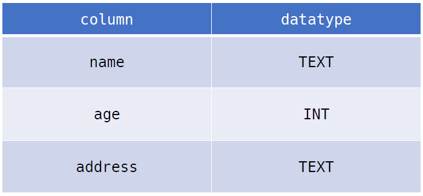

## SQL 기초

### 테이블 생성 및 삭제

- 데이터베이스 생성하기

```sqlite
$ sqlite3 tutorial.sqlite3
sqlite> .database
-- '.'은 sqlite에서 활용되는 명령어
```

- csv 파일을 table로 만들기

```sqlite
sqlite> .mode csv
sqlite> .import hellodb.csv examples
sqlite> .tables
examples
```

- `SELECT` 확인하기

```sqlite
sqlite> SELECT * FROM examples;
1, "홍길동", "서울", 010-1234-5678
-- SELECT문은 특정 테이블의 레코드(행) 정보를 반환
```

- 터미널 view 변경하기

```sqlite
-- 기본
sqlite> SELECT * FROM examples;
1, "홍길동", "서울", 010-1234-5678

-- .headers on
sqlite> .headers on
sqlite> SELECT * FROM examples;
id, name, country, phone
1, "홍길동", "서울", 010-1234-5678

-- .mode column
sqlite> .mode column
sqlite> SELECT * FROM examples;
id  name  country  phone
--  ----  -------  -----
1   홍길동  서울     010-1234-5678
```

- `CREATE TABLE`: 데이터베이스에서 테이블 생성 ⭐⭐⭐
  - 필드이름(name), 타입(TEXT), 제약 조건 으로 구성

```sqlite
-- classmates라는 이름의 테이블 생성
sqlite> CREATE TABLE classmates (
		id INTEGER PRIMARY KEY,
		name TEXT NOT NULL
    	age INTEGER NOT NULL
		);
		
-- 테이블 목록 조회
sqlite> .tables
classmates examples

-- 특정 테이블의 schema 조회
sqlite> .schema classmates
CREATE TABLE classmates (
id INTEGER PRIMARY KEY,
name TEXT NOT NULL
age INTEGER NOT NULL
);
```

- `DROP TABLE`: 데이터베이스에서 테이블 제거

```sqlite
sqlite> DROP TABLE classmates;
sqlite> .tables
examples
```

- 필드 제약 조건
  - `NOT NULL`: NULL 값 입력 금지
  - `UNIQUE` : 중복 값 입력 금지 (NULL 값은 중복 입력 가능)
  - `PRIMARY KEY` : 테이블에서 반드시 하나. NOT NULL + UNIQUE
  - `FOREIGN KEY` : 외래키. 다른 테이블의 Key
  - `CHECK` : 조건으로 설정된 값만 입력 허용
  - `DEFAULT` : 기본 설정 값

```sqlite
CREATE TABLE students(
	id INTEGER PRIMARY KEY,
	name TEXT NOT NULL, -- NULL값 입력 금지
	age INTEGER DEFAULT 1 CHECK (0 < age) -- age는 0보다 커야함
);
```

### 실습

- 다음과 같은 schema를 가지고 있는 classmates 테이블을 만들고 schema 확인하기



```sqlite
-- 테이블 생성
CREATE TABLE classmates (
name TEXT,
age INT,
address TEXT
);

-- schema 확인
sqlite> .schema classmates
CREATE TABLE classmates (
name TEXT,
age INT,
address TEXT
);
```

### 정리

```sql
-- classmates라는 이름의 테이블 생성
CREATE TABLE classmates (
    id INTEGER PRIMARY KEY, 
    name TEXT
);

-- 테이블 목록 조회
.tables

-- 특정 테이블 스키마 조회
.schema classmates

-- 값 추가
INSERT INTO classmates VALUES (1, '조세호');

-- 테이블 조회
SELECT * FROM classmates;

INSERT INTO classmates VALUES (2, '유재석');

-- 테이블 삭제
DROP TABLE classmates;
```

# CRUD

> Create Read Update Delete. 데이터 활용 시 가장 기본적인 데이터 처리 기능

|      | 구문     | 예시                                                         |
| ---- | -------- | ------------------------------------------------------------ |
| C    | `INSERT` | `INSERT INTO 테이블이름 (컬럼1, 컬럼2, ...) VALUES (값1, 값2);` |
| R    | `SELECT` | `SELECT * FROM 테이블이름 WHERE 조건;`                       |
| U    | `UPDATE` | `UPDATE 테이블이름 SET 컬럼1=값1, 컬럼2=값2 WHERE 조건;`     |
| D    | `DELETE` | `DELETE FROM 테이블이름 WHERE 조건;`                         |

## CREATE (생성)

### `INSERT`

- " insert a single row into a table "
- 테이블에 단일 행 삽입

```sqlite
INSERT INTO 테이블_이름 (컬럼1, 컬럼2) VALUES (값1, 값2);
```

- 테이블에 정의된 모든 컬럼에 맞춰 순서대로 입력 (컬럼 입력 필요없음)

```sqlite
INSERT INTO 테이블_이름 VALUES (값1, 값2, 값3);
```

- `rowid`
  - SQLite에서 PRIMARY KEY가 없는 경우 자동으로 증가하는 PK 컬럼
  - PRIMARY KEY 값을 추가하지 않아도 rowid이 자동으로 생성됨 (Auto increment)

```sqlite
sqlite> SELECT rowid, * FROM classmates;
rowid	name	age		address
------- ------- ------- ----------
1 		홍길동	  23      
2		홍길동   30       서울

-- NAME만 조회할 때
SELECT name FROM classmates;
홍길동
홍길동
```

### 실습

- `INSERT` 해보기

```sqlite
INSERT INTO classmates VALUES 
('홍길동', 30, '서울'), 
('김철수', 30, '제주'),
('이호영', 26, '인천'),
('박민희', 29, '대구'),
('최혜영', 28, '전주');
```

- classmates 테이블에 (이름: 홍길동, 나이: 23)인 데이터를 넣고 SELECT문을 통해 확인하기

```sqlite
CREATE TABLE classmate (
	name TEXT,
	age INT,
	address TEXT
);

-- 컬럼의 모든 값에 입력 하지 않을 경우 컬럼 지정을 해주어야함
INSERT INTO classmate (name, age) VALUES ('홍길동', 23);
-- 컬럼의 모든 값을 넣을 경우 컬럼 지정을 안해줘도 됨
INSERT INTO classmate VALUES ('홍길동', 30, '서울');

SELECT * FROM classmate;
name	age		address
------- ------- --------
홍길동	  23      
홍길동   30       서울
```

## READ (조회)

### `SELECT`

- "query data from a table"
- 테이블에서 데이터 조회
- 여러가지 조건을 걸 수 있음 (* 같은거)
- `SELECT`문은 SQLite에서 가장 기본이 되는 문이며 다양한 절(clause)와 함께 사용
  -  `ORDER BY`, `DISTINCT`, `WHERE`,` LIMIT`,` GROUP BY` ...

### `WHERE`

- "specify the search condition for rows returned by the query"
- 쿼리에서 반환된 행에 대한 특정 검색 조건을 지정

### `DISTINCT`

- "remove duplicate rows in the result set"

- 조회 결과에서 중복 행을 제거 (중복 없이 조회하기)
- DISTINCT 절은 SELECT 키워드 바로 뒤에 작성해야 함

### `LIMIT`

- "constrain the number of rows returned by a query"
- 쿼리에서 반환되는 행 수를 제한
- 특정 행부터 시작해서 조회하기 위해 `OFFSET` 키워드와 함께 사용하기도 함
- 출력에만 영향을 준다 ⭐⭐⭐

### `OFFSET`

- 처음부터 주어진 요소나 지점까지의 차이를 나타내는 명령어
- `OFFSET 5` ===> 6번째 부터 조회 (참고로 0부터 시작임)
- 출력에만 영향을 준다 ⭐⭐⭐

### `COUNT`

- 데이터 개수 조회

### 실습

- classmates 테이블에서 id, name 컬럼 값만 조회하기

```sqlite
SELECT rowid, name FROM classmates;
rowid  name
-----  ----
1      홍길동
2      김철수
3      이호영
4      박민희
5      최혜영
```

- classmates 테이블에서 id, name 컬럼 값을 하나만 조회하기

```sqlite
SELECT rowid, name FROM classmates LIMIT 1;
rowid  name
-----  ----
1      홍길동
```

- classmates 테이블에서 id, name 컬럼 값을 세번째에 있는 하나만 조회하기

```sqlite
SELECT rowid, name FROM classmates LIMIT 1 OFFSET 2;
rowid  name
-----  ----
3      이호영
```

- classmates 테이블에서 id, name 컬럼 값 중에 주소가 서울인 경우의 데이터를 조회

```sqlite
SELECT * FROM classmates WHERE address='서울';
name  age  address
----  ---  -------
홍길동 30   서울
```

- classmates 테이블에서 age값 전체를 중복없이 조회하기

```sqlite
SELECT DISTINCT age FROM classmates;
age
---
30
26
29
28
```

- 총 몇개의 데이터인지 조회

```sql
SELECT CONUT(*) FROM healthcare;
COUNT(*)
--------
1000000
```

- 몸무게가 70 이상인 데이터 개수 조회

```sql
SELECT CONUT(*) FROM healthcare WHERE weight>=70;
COUNT(*)
--------
283474
```

## UPDATE (수정)

```sql
UPDATE classmates SET name='홍길동', address='제주도' WHERE rowid=5;
SELECT rowid, * FROM classmates;
rowid  name  age  address
-----  ----  ---  -------
1      홍길동   30   서울
2      김철수   30   제주
3      이호영   26   인천
4      박민희   29   대구
5      홍길동   40   제주도
```

## DELETE (삭제)

- rowid = 5인 데이터 삭제

```sql
DELETE FROM classmates WHERE rowid=5;
rowid  name  age  address
-----  ----  ---  -------
1      홍길동   30   서울
2      김철수   30   제주
3      이호영   26   인천
4      박민희   29   대구
```
