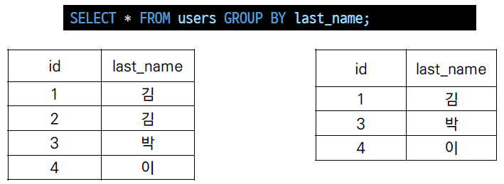

# SQL 문법

## `WHERE`

- 특정조건으로 데이터 조회

```sql
SELECT * FROM 테이블이름 WHERE 조건
```

### WHERE절 연산자

- 비교 연산자
  - `=`, ` >`, `>=`, ` <`, ` <=`  
  - 숫자 또는 문자 값의 대/소, 동일여부를 확인하는 연산자
- 논리 연산자
  - `AND` : 앞에 있는 조건과 뒤에 오는 조건이 모두 참인 경우
  - `OR` : 앞의 조건이나 뒤의 조건이 참인 경우
  - `NOT` : 뒤에 오는 조건의 결과를 반대로

### 실습

- users 테이블에서 age가 30이상인 유저의 모든 컬럼 정보 조회

```sql
SELECT * FROM users WHERE age >= 30;
```

- users 테이블에서 age가 30이상인 유저의 이름 정보 조회

```sql
SELECT first_name FROM users WHERE age >= 30;
```

- users 테이블에서 age가 30이상인 유저의 이름 3개 정보 조회

```sql
SELECT first_name FROM users WHERE age >= 30 LIMIT 3;
```

- users 테이블에서 age가 30이상이고 성이 '김'인 사람의 나이와 이름 정보 조회

```sql
SELECT age, first_name FROM users WHERE age >= 30 AND last_name = '김';
```

## SQL 연산자

- `BETWEEN 값1 AND 값2`
  - 값1과 값2 사이의 비교 (값1 <= 비교값 <= 값2)
- `IN (값1, 값2, ...)`
  - 목록 중에 값이 하나라도 일치하면 성공
- `LIKE`
  - 비교 문자열과 형태 일치
  - 와일드카드 (`%` : 0개 이상 문자, `_` : 1개 단일 문자)
- `IS NULL` / `IS NOT NULL`
  - NULL 여부를 확인할 때는 항상 `=` 대신 `IS`를 사용
- 부정 연산자
  - `!=`, `^=`, `<>` : 같지 않다
  - `NOT 칼럼명 =` : ~와 같지 않다
  - `NOT 칼럼명 >` : ~보다 크지 않다 

```sql
WHERE 칼럼명 1 != 비교값 1
AND 칼럼명 2 ^= 비교값 2
AND 칼럼명 3 <> 비교값 3
AND NOT 칼럼명 4 = 비교값 4
AND NOT 칼럼명 5 > 비교값 5;
```

- 연산자 우선순위
  - 1순위 : `괄호 ()`
  - 2순위 : `NOT`
  - 3순위 : `비교 연산자, SQL`
  - 4순위 : `AND`
  - 5순위 : `OR`

- 우선순위 주의 ❗

```sql
-- 1. 키가 175이거나 / 키가 183이면서 몸무게가 80인 사람
WHERE HEIGHT = 175 OR HEIGHT = 183 AND WEIGHT = 80
-- 2. 키가 175 또는 183인 사람 중에서 몸무게가 80인 사람
WHERE (HEIGHT = 175 OR HEIGHT = 183) AND WEIGHT = 80
```

### LIKE

- "query data based on pattern matching"
- 패턴 일치를 기반으로 **데이터를 조회**하는 방법

```sql
SELECT * FROM 테이블이름 WHERE 컬럼 LIKE '패턴';
```

- SQLite는 패턴 구성을위한 2개의 wildcards를 제공

#### Wildcards

- `%` (percent sign)
  - 0개 이상의 문자
  - 이 자리에 문자열이 있을수도, 없을수도 있음

- `_` (underscore)
  - 임의의 단일 문자
  - 반드시 이 자리에 한개의 문자가 존재해야함

- wildcards 사용 예시

```sql
SELECT * FROM 테이블이름 WHERE 컬럼 LIKE '패턴';
```

|  와일드카드패턴  |                      의미                       |
| :--------------: | :---------------------------------------------: |
|       `2%`       |                 2로 시작하는 값                 |
|       `%2`       |                  2로 끝나는 값                  |
|      `%2%`       |                 2가 들어있는 값                 |
|      `_2%`       | 아무 값이 하나 있고 두번째 값이 2로 시작하는 값 |
|      `1___`      |           1로 시작하고 총 4자리인 값            |
| `2_%_%` / `2__%` |         2로 시작하고 적어도 3자리인 값          |

#### 실습

- users 테이블에서 나이가 20대인 사람을 조회

```sql
SELECT * FROM users WHERE age LIKE '2_';
```

- users 테이블에서 지역 번호가 02인 사람만 조회

```sql
SELECT * FROM users WHERE phone LIKE '02-%'
```

- users 테이블에서 이름이 '준' 으로 끝나는 사람만 조회

```sql
SELECT * FROM user WHERE first_name LIKE '%준';
```

- users 테이블에서 중간 번호가 5114인 사람만 조회

```sql
SELECT * FROM user WHERE phone LIKE '%-5114-%'
```

### ORDER BY

- "sort a result set of a query"
- 조회 결과 집합을 **정렬**
- SELECT 문에 추가하여 사용
- 정렬 순서를 위한 2개의 keyword 제공
  - `ASC` - 오름차순 (default)
  - `DESC` - 내림차순

- 특정 컬럼을 기준으로 데이터를 정렬하여 조회

```sql
SELECT * FROM 테이블이름 ORDER BY 컬럼 ASC;
SELECT * FROM 테이블이름 ORDER BY 컬럼 DESC;
```

#### 실습

- users에서 나이 순으로 오름차순 정렬하여 상위 10개 조회

```sql
SELECT * FROM users ORDER BY age ASC LIMIT 10;
```

- 나이 순, 성 순으로 오름차순 정렬하여 상위 10개 조회

```sql
SELECT * FROM users ORDER BY age, last_name ASC LIMIT 10;
```

- 계좌 잔액 순으로 내림차순 정렬하여 해당 유저의 성과 이름 10개 조회

```sql
SELECT last_name, first_name FROM users ORDER BY balance DESC LIMIT 10;
```

## SQLite Aggregate Functions

> Aggregate function (집계 함수)

- 값 집합에 대한 계산을 수행하고 단일 값을 반환
  - 여러 행으로부터 하나의 결과값을 반환하는 함수

- SELCET 구문에서만 사용됨

### `COUNT`

- 레코드 개수 조회

- 그룹의 항목 수를 반환

```sql
SELECT COUNT(컬럼) FROM 테이블이름;
```

### `AVG`

- 전체 또는 지정된 컬럼의 평균값 반환
- 해당 컬럼이 `INTEGER`일 때만 사용 가능

```sql
SELECT AVG (컬럼) FROM 테이블이름;

-- 30살 이상인 사람들의 평균 나이
SELECT AVG(age) FROM users WHERE age>=30;
```

### `MAX`

- 그룹에 있는 모든 값 중 최대값 반환

- 해당 컬럼이 `INTEGER`일 때만 사용 가능

```sql
SELECT MAX (컬럼) FROM 테이블이름;

-- 계좌 잔액이 가장 높은 사람과 그 액수
SELECT first_name, MAX(balance) FROM users;
```

### `MIN`

- 그룹에 있는 모든 값 중 최소값 반환
- 해당 컬럼이 `INTEGER`일 때만 사용 가능

```sql
SELECT MIN (컬럼) FROM 테이블이름;
```

### `SUM`

- 모든 값의 합 반환

- 해당 컬럼이 `INTEGER`일 때만 사용 가능

```sql
SELECT SUM (컬럼) FROM 테이블이름;

-- 나이가 30 이상인 사람들의 계좌 평균 잔액 조회
SELECT AVG(balance) FROM users WHERE age>=30;
```

# 기본 함수와 연산

## 문자열 함수

- `SUBSTR(문자열, start, length)` : 문자열 자르기
  - 시작 인덱스는 1, 마지막 인덱스는 -1
- `TRIM(문자열)`, `LTRIM(문자열)`, `RTRIM(문자열)` : 문자열 공백 제거
- `LENGTH(문자열)` : 문자열 길이
- `REPLACE(문자열, 패턴, 변경값)` : 패턴에 일치하는 부분을 변경
- `UPPER(문자열)`, `LOWER(문자열)` : 대소문자 변경
- `||` : 문자열 합치기(concatenation)

## 숫자 함수

- `ABS(숫자)` : 절대값
- `SIGN(숫자) `: 부호 (양수 1, 음수 - 1, 0 0)
- `MOD(숫자1, 숫자2)` : 숫자1을 숫자2로 나눈 나머지
- `CEIL(숫자)` : 올림
- `FLOOR(숫자)` : 내림
- `ROUND(숫자)` :  반올림

- `SQRT(숫자)` : 제곱근

- `POWER(숫자, 제곱수)` : 제곱수

- 산술연산자

  - `+`,` -`, `/`, `* `와 같은 산술연산자와 우선 순위를 지정하는 () 기호를 연산에 활용할 수 있음

  ```sql
  SELECT age+1 FROM users;
  ```

## `ALIAS`

- 칼럼명이나 테이블명이 너무 길거나 다른 명칭으로 확인하고 싶을 때는 `ALIAS`를 활용
- `AS`를 생략하여 공백으로 표현할 수 있음
- 별칭에 공백, 특수문자 등이 있는 경우 따옴표로 묶어서 표기
- `ALIAS` 사용 시 **큰 따옴표를 사용**하고 그 외엔 작은따옴표 사용

```sql
SELECT last_name 성 FROM users;
SELECT last_name AS 성 FROM users;
SELECT last_name AS 성 FROM users WHERE 성='김';
```

## `GROUP BY`

- "make a set of summary rows from a set of rows"
- SELECT문의 optional 절

```sql
SELECT * FROM 테이블이름 GROUP BY 컬럼1, 컬럼2;
```

- 행 집합에서 요약 행 집합을 만듦
- 선택된 행 그룹을 하나 이상의 열 값으로 요약 행으로 만듦
- **문장에 WHERE 절이  포함된 경우 반드시 WHERE 절 뒤에 작성해야함**
- 지정된 컬럼의 값이 같은 행들로 묶음
- 집계함수와 활용하였을 때 의미가 있음
- 그룹화된 각각의 그룹이 하나의 집합으로 집계함수의 인수로 넘겨짐



- GROUP BY 절에 명시하지 않은 컬럼은 별도로 지정할 수 없음
  - 그룹마다 하나의 행을 출력하게 되므로 집계함수 등을 활용해야함
- GROUP BY의 결과는 정렬되지 않음
  - 기존의 순서와 바뀌는 모습도 있음
  - 원칙적으로 관계형 데이터베이스에서는 **ORDER BY를 통해 정렬**

- users에서 각 성(last_name)씨가 몇 명씩 있는지 조회

```sql
SELECT last_name, COUNT(*) FROM users GROUP BY last_name;
```

## `HAVING`

- **집계함수는 WHERE절의 조건식에서는 사용할 수 없음** (실행 순서에 의해서)
  - WHERE로 처리하는 것이 GROUP BY 그룹화보다 순서상 앞서 있기 때문
- 집계 결과에서 조건에 맞는 값을 따로 활용하기 위해 HAVING 사용
- 집계함수로 조건을 줄 때만 `HAVING` 사용, 이 외(부등호 등등)에는 `WHERE` 사용

```sql
SELECT * FROM 테이블이름 GROUP BY 컬럼1, 컬럼2 HAVING 그룹조건;
```

## ⭐ SELECT 문장 실행 순서

- `FROM => WHERE => GROUP BY => HAVING => SELECT => ORDER BY`
  - `FROM` 테이블을 대상으로
  - `WHERE` 제약조건에 맞춰 뽑아서
  - `GROUP BY` 그룹화 한다
  - `HAVING` 그룹 중에 조건과 맞는 것 만을
  - `SELECT` 조회하여
  - `ORDER BY` 정렬하고
  - `LIMIT/OFFSET` 특정 위치의 값을 가져온다

```SQL
SELECT 컬럼명
FROM 테이블명
WHERE 조건식
GROUP BY 칼럼 혹은 표현식
HAVING 그룹조건식
ORDER BY 칼럼 혹은 표현식
LIMIT 숫자 OFFSET 숫자;
```

## `ALTER TABLE`

- 컬럼이변경된다거나, 테이블자체의 이름을 바꾼다거나 할 때
- 테이블 이름 변경
- 새로운 column 추가
  - 테이블에 있던 기존 레코드들에는 새로 추가할 필드에 대한 정보가 없으므로 NOT NULL 형태의 컬럼은 추가 불가능
  - NOT NULL 설정 없이 추가하거나,
  - 기본 값(DEFAULT) 설정해서 추가해야함
- column 이름 수정 (new in sqlite 3.25.0)
- column 삭제 (new in sqlite 3.35.0)

```SQL
-- 1. 테이블 이름 변경
ALTER TABLE 기존테이블이름 RENAME TO 새로운테이블이름;

-- 2. 새로운 컬럼 추가
ALTER TABLE 테이블이름 ADD COLUMN 컬럼이름 데이터타입설정;

-- 3. 컬럼 이름 수정
ALTER TABLE table_name RENAME COLUMN current_name TO new_name;

-- 4. 컬럼 삭제
ALTER TABLE table_name DROP COLUMN column_name;
```

### 실습

```sql
-- 테이블 생성
-- title과 content라는 컬럼을 가진 articles이라는 이름의 테이블
-- 두 컬럼 모두 비어있지 않으며 rowid 사용
CREATE TABLE articles (
title TEXT NOT NULL,
content TEXT NOT NULL
);

-- 테이블에 값 추가하기
INSERT INTO articles VALUES ('1번 제목', '1번 내용')

-- 테이블 이름 변경
ALTER TABLE articles RENAME TO news;

-- 테이블 확인
.tables

-- 새로운 컬럼 추가하기
ALTER TABLE news ADD COLUMN created_at TEXT NOT NULL;
-- Error!
-- 1. NOT NULL 설정 없이 추가하기
ALTER TABLE news ADD COLUMN created_at TEXT;
-- 2. 기본 값(DEFAULT) 설정하기
ALTER TABLE news ADD COLUMN created_at TEXT NOT NULL DEFAULT '기본 값';
```

# `CASE`

- CASE 문은 특정 상황에서 데이터를 변환하여 활용할 수 있음
- ELSE를 생략하는 경우 NULL값이 지정됨

```sql
CASE
	WHEN 조건식 THEN 식
	WHEN 조건식 THEN 식
    ELSE 식
END
```

- gender가 1인 경우 남자를, 2인 경우 여자를 출력하시오.

```sql
SELECT id,
CASE
	WHEN gender = 1 THEN '남자'
	WHEN gender = 2 THEN '여자'
END
FROM healthcare LIMIT 3;
```

- 나이에 따라 청소년(~18), 청년(~30), 중장년(~64)로 출력하시오.

```sql
SELECT last_name, age,
CASE
	WHEN age < 18 THEN '청소년'
	WHEN age <= 30 THEN '청년'
	WHEN age <= 64 THEN '중장년'
END
FROM healthcare LIMIT 15;
```
