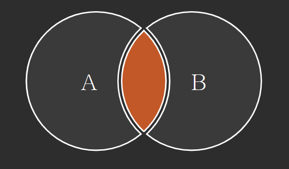
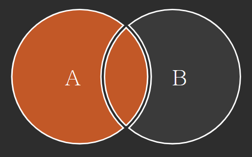
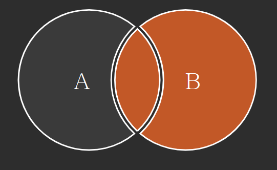
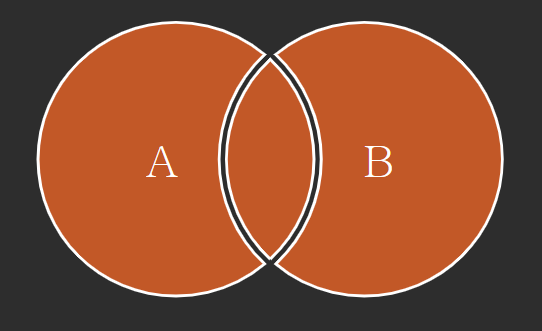

# Join

- 관계형 데이터베이스의 가장 큰 장점이자 핵심적인 기능
- 일반적으로 데이터베이스에는 하나의 테이블에 많은 데이터를 저장하는 것이 아니라 여러 테이블로 나눠 저장하게 되며, 여러 테이블을 결합(Join)하여 출력하여 활용
- 일반적으로 레코드는 기본키(PK)나 외래키(FK) 값의 관계에 의해 결합함

## `INNER JOIN`

- 두 테이블에 모두 일치하는 행만 반환

- 조건에 일치하는 (동일한 값이 있는) 행만 반환

```sql
SELECT *
FROM 테이블1 [INNER] JOIN 테이블2
	ON 테이블1.칼럼 = 테이블2.칼럼;
```



### 연습

- 사용자(users)와 각각의 역할을 출력하시오

```sql
SELECT * FROM users 
INNER JOIN role ON users.role_id = role.id;
-- INNER 생략 가능
```

- staff(2) 사용자(users)를 역할과 함께 출력하시오

```sql
SELECT * FROM users 
INNER JOIN role ON users.role_id = role.id 
WHERE role.id = 2;
```

- 사용자(users)와 각각의 역할을 이름의 내림차순으로 출력하시오

```sql
SELECT * FROM users 
INNER JOIN role ON users.role_id = role.id 
ORDER BY users.name DESC;
```

## `OUTER JOIN`

- 동일한 값이 없는 행도 반환
- 기준이 되는 테이블에 따라 LEFT/RIGHT/FULL 지정

```sql
SELECT * FROM 테이블1 [LEFT|RIGHT|FULL] OUTER JOIN 테이블2 ON 테이블1.칼럼 = 테이블2.칼럼;
```

### `LEFT OUTER JOIN`



### `RIGHT OUTER JOIN`



### `FULL OUTER JOIN`



### 연습

- 모든 게시글을 사용자 정보와 함께 출력하시오

```sql
SELECT * FROM articles 
LEFT OUTER JOIN users ON users.id = articles.user_id;
```

- 작성자가 있는 모든 게시글을 사용자 정보와 함께 출력하시오

```sql
SELECT * FROM articles
LEFT OUTER JOIN users ON users.id = articles.user_id
WHERE articles.user_id IS NOT NULL;
```

- 모든 게시글과 모든 사용자 정보를 출력하시오

```sql
SELECT * FROM articles
FULL OUTER JOIN users ON users.id = articles.user_id;
```

## `CROSS JOIN`

- 모든 데이터의 조합
- 모든 가능한 경우의 수 Join

```sql
SELECT * FROM 테이블1 CROSS JOIN 테이블2;
```

### 연습

- users와 role의 `CROSS JOIN` 결과를 출력하시오

```sql
SELECT * FROM users CROSS JOIN role;
```

## 참고

- [SQL Joins Visualizer](https://sql-joins.leopard.in.ua/)