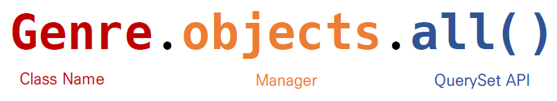

# ORM

- Object-Relational-Mapping
- 객체 지향 프로그래밍 언어를 사용하여 호환되지 않는 유형의 시스템 간의 데이터를 변환하는 프로그래밍 기술
- 파이썬에서는 SQLAlchemy, peewee 등 라이브러리가 있으며 Django 프레임워크에서는 내장 Django ORM을 활용

### "객체(Object)로 DB를 조작한다."

```python
Genre.objects.all()
=
SELECT * FROM Genre;
```

- 모델 설계 및 반영

  (1) 클래스를 생성하여 원하는 구조의 DB를 만든다.

  ```python
  class Genre(models.Model):
      name = models.CharField(max_length=30)
  ```
  
  (2) 클래스의 내용으로 데이터베이스에 반영하기 위한 마이그레이션 파일을 (자동)생성 한다.
  
  ```bash
  $ python manage.py makemigrations
  ```
  
  (3) DB에 migrate 한다.
  
  ```bash
  $ python manage.py migrate
  ```

## Migration (마이그레이션)

- Model에 생긴 변화를 DB에 반영하기 위한 방법
- 마이그레이션 파일을 만들어 DB 스키마를 반영한다
- 명령어
  - makemigrations : 마이그레이션 파일 생성
  - migrate : 마이그레이션을 DB에 반영

- Migrate 살펴보기

```sql
-- Migrate 하는 순간 아래와 같은 쿼리 실행됨

BEGIN;
--
-- Create model Genre
--
CREATE TABLE "db_genre" (
	"id" integer NOT NULL PRIMARY KEY AUTOINCREMENT,
	"name" varchar(30) NOT NULL
);
COMMIT;
```

- 데이터베이스 조작 (Database API)



## ORM 기본 조작

### Create

```python
# 1. create 메서드 활용
Genre.objects.create(name = '발라드')

# 2. 인스턴스 조작
genre = Genre()
genre.name = '인디밴드'
genre.save()
```

### Read

```python
# 1. 전체 데이터 조회
Genre.objects.all()
# <QuerySet [<Genre: Genre object (1)>, <Genre:Genre object (2)>]>

# 2. 일부 데이터 조회(get)
# ⭐ 한개의 데이터 조회, 0개이거나 2개 이상일 경우 오류 뜸
# ⭐ pk로 데이터를 조회할 때
Genre.objects.get(id=1)
# <Genre: Genre object (1)>

# 3. 일부 데이터 조회(filter)
# ⭐ 결과가 무조건 QuerySet으로 나온다 (일종의 리스트)
# ⭐ 0개이거나 두개 이상의 데이터 조회
Genre.objects.filter(id=1)
# <QuerySet [<Genre: Genre object (1)>]>
```

### Update

```python
# 1. genre 객체 활용
genre = Genre.object.get(id=1)

# 2. genre 객체 속성 변경
genre.name = '인디음악'

# 3. genre 객체 저장
genre.save()
```

```python
genre = Genre.objects.get(id=1)

genre.name
# '인디밴드'

genre.name = '인디음악'

genre.save()
```

### Delete

```python
# 1. genre 객체 활용
genre = Genre.objects.get(id=1)

# 2. genre 객체 삭제
genre.delete()
```

```python
genre = Genre.objects.get(id=1)

genre.name
# '인디밴드'

genre.delete()
```

## 정리

``` python
# 마이그레이션 파일 생성
$ python manage.py makemigrations
# 마이그레이션을 DB에 반영
$ python manage.py migrate
# DB 확인
$ sqlite3 db.sqlite3
# 데이터베이스 조작을 위해 shell 접속
$ python manage.py shell_plus
```

```python
Genre.objects.all()
# <QuerySet [<Genre: Genre object (1)>, <Genre: Genre object (2)>, <Genre: Genre object (3)>]

type(Genre.objects.all())
# django.db.models.query.QuerySet

Genre.objects.all()[0]
# <Genre: Genre object (1)>

Genre.objects.all()[0].name
# '인디밴드'

genres = Genre.objects.all()
for genre in genres:
	print(genre.name)
# 인디밴드
# 트로트
# 락

Genre.objects.get(id=1)
# <Genre: Genre object (1)>

Genre.objects.filter(id=1)
# <QuerySet [<Genre: Genre object (1)>]>
```

