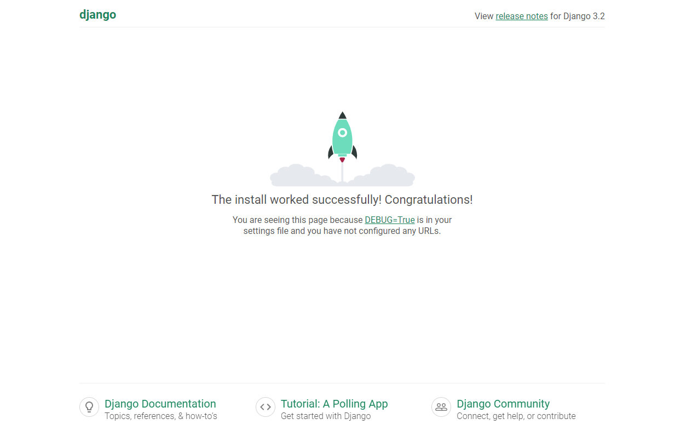

# Django 개발 환경 설정 가이드

- 가상환경 생성 / 실행

```bash
$ python -m venv [가상환경이름]

$ source [가상환경이름]/Scripts/activate
(venu)
```

```bash
$ cd ~

$ mkdir server # 가상환경을 실행할 폴더 만들기

$ cd server/

$ python -m venv server-venv # 가상환경 생성

$ source server-venv/Scripts/activate # 가상환경 acivate
(server-venv)

$ pip list # 설치된 리스트 조회
Package    Version
---------- -------
pip        22.0.4
setuptools 58.1.0
```

- Django LTS 버전 설치

```bash
$ pip install django==3.2.13

$ pip list
```

- Django 프로젝트 생성

```bash
$ django-admin startproject [프로젝트이름] [시작경로]
```

```bash
$ django-admin startproject firstpjt .
(server-venv)

$ ls
firstpjt/  manage.py*  server-venv/
(server-venv)

$ code . # VScode 실행
(server-venv)
```

- Django 실행

```bash
$ python manage.py runserver

주소창에 localhost:8000
```



- 앱 생성 

```bash
$ cd [프로젝트 이름]

$ ls 
# ls 명령어 입력 후 현재 경로에서 manage.py 파일이 있는지 확인❗

$ python manage.py startapp [앱 이름]
```

- 앱 등록

```bash
# VScode 실행
code .

# 프로젝트설정폴더/settings.py - INSTALLED_APPS 리스트에 생성한 앱 추가
```

- 가상환경 삭제

```bash
$ sudo rm -rf [가상환경이름]
```

- 가상환경 비활성화

```bash
$ deactivate
```

- 데이터

```bash
# models.py 등록

$ python manage.py makemigrations
$ python manage.py migrate
```

