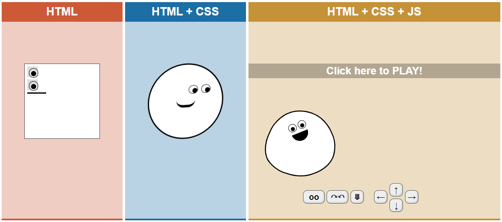

# Web

- 웹사이트의 구성 요소
  - HTML : 구조
  - CSS : 표현
  - Javascript : 동작
- https://html-css-js.com/

## 웹사이트와 브라우저

- 웹사이트는 브라우저를 통해 작동함
- 브라우저마다 동작이 약간씩 달라서 문제가 생기는 경우가 많음 (파편화)
- 해결책으로 웹 표준이 등장

- 크롬, 파이어폭스, 오페라, 사파리 등등

## 웹 표준

- 웹에서 표준적으로 사용되는 기술이나 규칙
- 어떤 브라우저든 웹 페이지가 동일하게 보이도록 함 (크로스 브라우징)

- 팀 버너스리

- WHATWG HTML Living Standard (Apple, Google, Microsoft, Mozilla)

- 브라우저별 호환성 체크 : [Can I use?](https://caniuse.com/)

## 개발 환경 설정

### Visual Code Studio

- HTML/CSS 코드 작성을 위한 VS Code 확장 프로그램 (추천)
  - Open in browser
  - Auto Rename Tag
  - Auto Close Tag
  - Intellisense for CSS class names in HTML
  - HTML CSS Support

### Chrome 개발자 도구

- 웹 브라우저 크롬에서 제공하는 개발과 관련된 다양한 기능을 제공
- 주요 기능
  - Elements - DOM 탐색 및 CSS 확인 및 변경
    - Styles - 요소에 적용된 CSS 확인
    - Computed - 스타일이 계산된 최종 결과
    - Event Listeners - 해당 요소에 적용된 이벤트 (JS)
  - Sources, Network, Performance, Application, Security, Audits 등