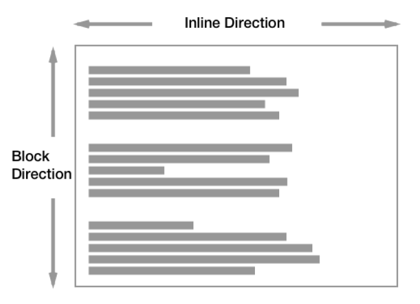

# CSS

> Cascading Style Sheets. 스타일을 지정하기 위한 언어


- CSS 구문은 선택자를 통해 스타일을 지정할 HTML 요소를 선택
- 중괄호 안에서는 속성과 값, 하나의 쌍으로 이루어진 선언을 진행
- 각 쌍은 선택한 요소의 속성, 속성에 부여할 값을 의미
  - 속성 (Property) : 어떤 스타일 기능을 변경할지 결정
  - 값 (Value) : 어떻게 스타일 기능을 변경할지 결정

## CSS 정의 방법

### 인라인 (inline)

- 해당 태그에 직접 style 속성을 활용

```html
<h1 style="color: blue; font-size: 100px;">Hello</h1>
```

### 내부 참조 (embedding) - `<style>`

- `<head>` 태그 내 `<style>` 태그에 지정

```html
<!DOCTYPE html>
<html lang="en">
<head>
  <meta charset="UTF-8">
  <meta name="viewport" content="width=device-width, initial-scale=1.0">
  <title>Document</title>
  <style>
	h1 {
	color: blue;
	font-size: 100px;
	}
  </style>
</head>
<body>
</body>
</html>
```

### 외부 참조 (link file) - 분리된 CSS 파일

- 외부 CSS 파일을 `<head>` 내 `<link>`를 통해 불러오기
- 외부 참조 방법을 쓰는 것이 가장 일반적

```html
<!DOCTYPE html>
<html lang="en">
<head>
  <meta charset="UTF-8">
  <meta name="viewport" content="width=device-width, initial-scale=1.0">
  <title>Document</title>
  <link rel="stylesheet" href="mystyle.css"
</head>
<body>
</body>
</html>
```

## CSS with 개발자 도구

- styles : 해당 요소에 선언된 모든 CSS
- computed : 해당 요소에 최종 계산된 CSS

## CSS 기초 선택자

### 선택자(Selector) 유형

- 기본 선택자

  - 전체 선택자, 요소 선택자

  - 클래스 선택자, 아이디 선택자, 속성 선택자

- 결합자 (Combinators)

  - 자손 결합자, 자식 결합자

  - 일반 형제 결합자, 인접 형제 결합자

- 의사 클래스/요소 (Pseudo Class)

  - 링크, 동적 의사 클래스

  - 구조적 의사 클래스, 기타의사 클래스, 의사 엘리먼트, 속성 선택자

### 선택자(Selector) 정리

- 요소 선택자
  - HTML 태그를 직접 선택
- 클래스(class) 선택자
  - 마침표(.) 문자로 시작하며, 해당 클래스가 적용된 항목을 선택
- 아이디(id) 선택자
  - `#` 문자로 시작하며, 해당 아이디가 적용된 항목을 선택
  - 일반적으로 하나의 문서에 1번만 사용
  - 여러번 사용해도 동작하지만 단일 id를 사용하는 것을 권장

## CSS 기본 스타일

### 크기 단위

- `px` (픽셀)
  - 모니터 해상도의 한 화소인 '픽셀' 기준
  - 픽셀의 크기는 변하지 않기 때문에 고정적인 단위
- `%`
  - 백분율 단위
  - 가변적인 레이아웃에서 자주 사용

- `em`
  - (바로 위, 부모 요소에 대한) 상속의 영향을 받음
  - 배수 단위, 요소에 지정된 사이즈에 상대적인 사이즈를 가짐
- `rem`
  - (바로 위, 부모 요소에 대한) 상속의 영향을 받지 않음
  - 최상위 요소(html)의 사이즈를 기준으로 배수 단위를 가짐

```html
<body>
  <ul class="font-big">
	  <li class="em">2em</li>
 	  <li class="rem">2rem</li>
	  <li>no class</li>
  </ul>
</body>
```

```html
<style>
  .font-big {
  font-size: 36px;
  }
  .em {
  font-size: 2em;
  }
  .rem {
  font-size: 2rem;
  }
</style>
```

#### em VS rem


#### viewport

- 웹페이지를 방문한 유저에게 바로 보이게 되는 웹 컨텐츠의 영역 (디바이스 화면)
- 디바이스의 viewpoint를 기준으로 상대적인 사이즈가 결정됨
- vw, vh, vmin, vmax

```html
<body>
<h1 class="px">px사용</h1>
<h1 class="vw">vw사용</h1>
</body>
```

```html
<style>
  h1 {
	color: black;
	background-color: pink;
  }
  .px {
	width: 200px;
  }
  .vw {
	width: 50vw;
  }
</style>
```

### 색상 단위

- 색상 키워드 (`background-color: red;`)
  - 대소문자 구분 X
  - red, black, blue와 같은 특정 색을 직접 글자로 나타냄
- RGB 색상 (`background-color: rgb(0, 255, 0);`)
  - 16진수 표기법 혹은 함수형 표기법을 사용해서 특정 색을 표현하는 방식
- HSL 색상 (`background-color: hsl(0, 100%, 50%);`)
  - 색상, 채도, 명도를 통해 특정 색을 표현하는 방식
- a는 alpha (투명도)

```html
<!-- 검정색 표현하기 -->

<!-- 색상 키워드 -->
p { color: black; }
p { color: #000; }
p { color: #000000; }

<!-- RGB 색상 -->
p { color: rgb(0, 0, 0); }
p { color: rgba(0, 0, 0, 0.5); }

<!-- HSL 색상 -->
p { color: hsl(120, 100%, 0); }
p { color: hsla(120, 100% 0.5);}
```

## CSS 문서 표현

### 텍스트

- `font-family` : 폰트
- `font-style`, `font-weight` : 폰트 스타일
- `letter-spacing` : 자간 
- `word-sapcing` : 단어 간격
- `line-height` : 행간

### 컬러

- `color`
- `background-image`
- `background-color`

### 기타 HTML 태그별 스타일링

- `li` : 목록
- `table` : 테이블

## CSS 적용 우선순위 (cascading order)

- 중요도 (Importance) : 사용시 주의
  - `!important`
- 우선순위 (Specificity)
  - 인라인 > id > class, 속성, pseudo-class > 요소, pseudo-element
- CSS 파일 로딩 순서


## CSS 상속

- CSS는 상속을 통해 부모 요소의 속성을 자식에게 상속한다.
  - 속성(프로퍼티) 중에는 상속이 되는것과 되지 않는 것들이 있다
  - 상속 되는 것 예시 : `text` 관련 요소 (`font`, `color`,` text-align`), `opacity`,` visibility` 등
  - 상속 되지 않는 것 예시 :` box model` 관련 요소(`width`, `heigh`t,` margin`, `padding`, `border`, `box-sizing`, `display`), `position `관련 요소(`position`, `top`/`right`/`bottom`/`left`, `z-index`) 등

```html
<body>
<p>안녕하세요! <span>테스트</span> 입니다.</p>
</body>
```

```css
<style>
  p {
    /* 상속됨 */
    color: red;
	/* 상속 안됨 */
	border: 3px solid black;
  }
  span {
  }
</style>
```

## CSS Box model

- 모든 요소는 네모(박스모델)이고, 위에서부터 아래로, 왼쪽에서 오른쪽으로 쌓임
- 모든 HTML 요소는 box 형태로 되어있음
- 하나의 박스는 4개의 영역으로 이루어짐
  - margin, border, padding, content


### Normal Flow



### box-sizing

- 기본적으로 모든 요소의 box-sizing은 content-box
  - Padding을 제외한 순수 contents 영역만을 box로 지정
- 다만 우리가 일반적으로 영역을 볼 때는 border까지의 너비를 100px 보는 것을 원함
  - 이 경우 box-sizing을 border-box로 설정

```html
<body>
  <div class="box">content-box</div>
  <div class="box box-sizing">border-box</div>
</body>
```

```css
<style>
  .box {
	width: 100px;
	margin: 10px auto;
	padding: 20px;
	border: 1px solid black;
	color: white;
	text-align: center;
	background-color: blueviolet;
  }
  .box-sizing {
	box-sizing: border-box;
	margin-top: 50px;
  }
</style>
```


## CSS Display

- display에 따라서 박스 모델의 크기와 배치가 달라진다

### block

- 줄 바꿈이 일어나는 요소
- 화면 크기 전체의 가로폭을 차지
- 블록 레벨 요소 안에 인라인 레벨 요소가 들어갈 수 있음
- `div`,` ul`,` ol`, `li`, `p`, `hr`, `form` 등

### inline

- 줄 바꿈이 일어나지 않는 행의 일부 요소
- content 너비만큼 가로 폭을 차지
- `width`, `height`, `margin-top`,` margin-bottom`을 지정 할 수 없음
- 상하 여백은 `line-height`로 지정
- `span`, `a`,` img`, `input`, `label`, `b`, `em`, `i`, `strong` 등

### inline-block

- block과 inline 레벨 요소의 특징을 모두 가짐
- inline처럼 한 줄에 표시할 수 있고, block처럼 `width`, `height`, `margin` 속성을 모두 지정할 수 있음

### none

- 해당 요소를 화면에 표시하지 않고 공간도 부여되지 않음
- 이와 비슷한` visibility: hidden`은 해당 요소가 공간은 차지하나 화면에 표시되지 않음

## 참고 자료

https://developer.mozilla.org/ko/docs/Web/CSS
