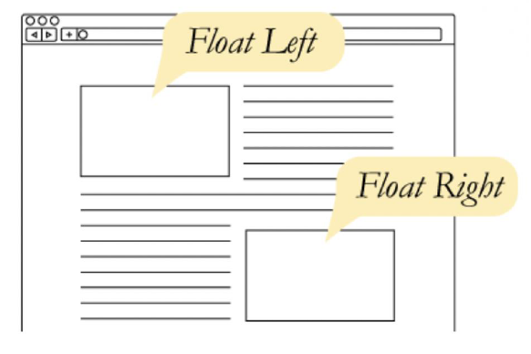
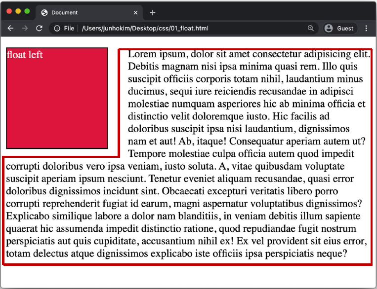
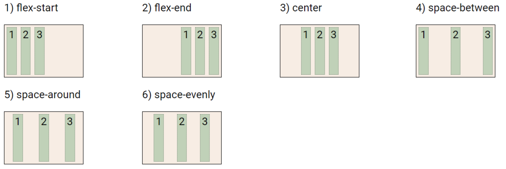
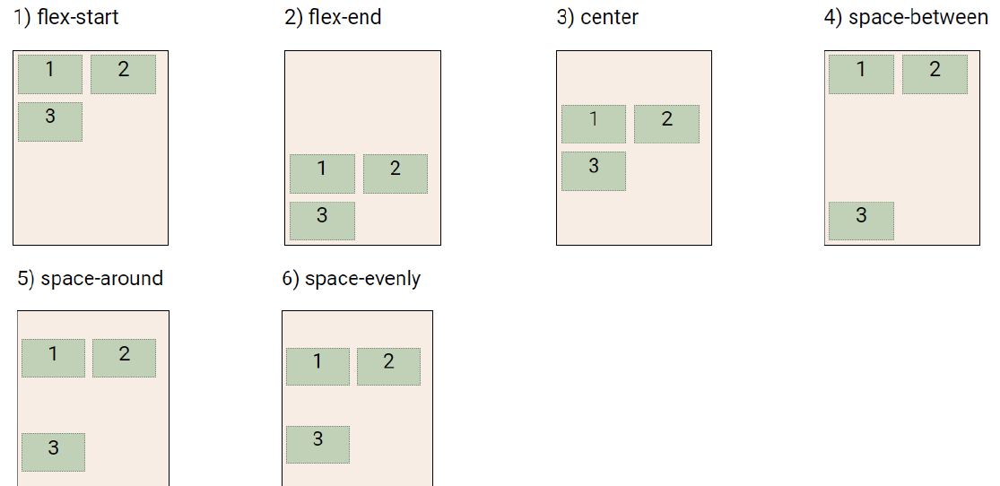
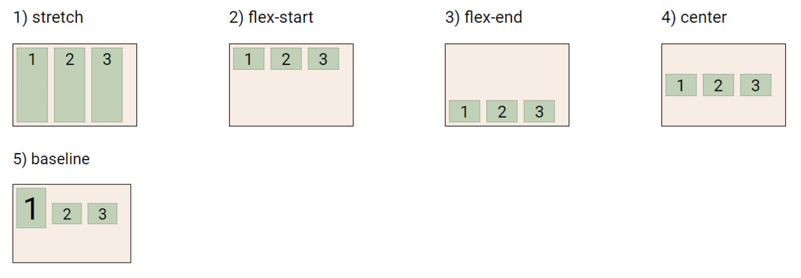
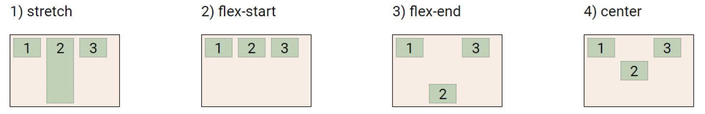
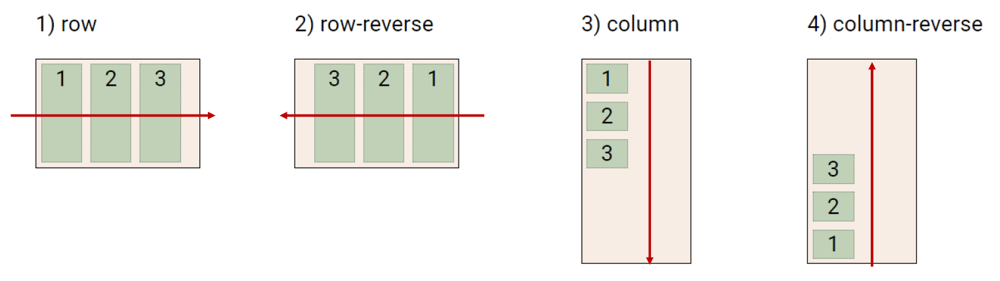
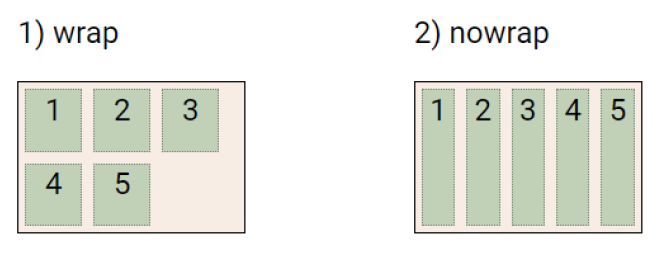

## CSS Position

- 문서 상에서 요소의 위치를 지정
- static : 모든 태그의 기본 값 (기준 위치)
  - 일반적인 요소의 배치 순서에 따름 (좌측 상단)
  - 부모 요소 내에서 배치될 때는 부모 요소의 위치를 기준으로 배치 됨
- 아래는 좌표 프로퍼티(top, bottom, left, right)를 사용하여 이동 가능
  - relative
  - absolute
  - fixed
  - sticky
- relative : 상대 위치
  - 자기 자신의 static 위치를 기준으로 이동 (normal flow 유지)
  - 레이아웃에서 요소가 차지하는 공간은 static일 떄와 같음 (normal position 대비 offset)
- absolute : 절대 위치
  - 요소를 일반적인 문서 흐름에서 제거 후 레이아웃에 공간을 차지하지 않음 (normal flow에서 벗어남)
  - static이 아닌 가장 가까이 있는 부모/조상 요소를 기준으로 이동 (없는 경우 브라우저 화면 기준으로 이동)

- fixed : 고정 위치
  - 요소를 일반적인 문서 흐름에서 제거 후 레이아웃에 공간을 차지하지 않음 (normal flow에서 벗어남)
  - 부모 요소와 관계없이 viewport를 기준으로 이동
    - 스크롤 시에도 항상 같은 곳에 위치함

- sticky : 스크롤에 따라 static -> fixed로 변경
  - 속성을 적용한 박스는 평소에 문서안에서 position: static 상태와 같이 일반적인 흐름에 따르지만 스크롤 위치가 임계점에 이르면 position: fixed와 같이 박스를 화면에 고정할 수 있는 속성
  - 일반적으로 Navigation Bar에서 사용됨

## CSS 원칙

### CSS 원칙I, II : Normal flow

- 모든 요소는 네모(박스모델), 좌측 상단에 배치
- display에 따라 크기와 배치가 달라짐

### CSS 원칙III : Position으로 위치의 기준을 변경

- relative : 본인의 원래 위치
- absolute : 특정 부모의 위치
- fixed : 화면의 위치
- sticky : 기본적으로 static이나 스크롤 이동에 따라 fixed로 변경


## CSS Layout

- Display
- Position
- Float (CSS1, 1996)
- Flexbox (2012)
- Grid (2017)
- 기타

### Float

- 박스를 왼쪽 혹은 오른쪽으로 이동시켜 텍스트 포함 인라인 요소들이 주변을 wrapping 하도록 함
- 요소가 Normal flow를 벗어나도록 함



#### 예시

```html
<body>
  <div class="box left">float left</div>
  <p>lorem300</p>
</body>
```

```css
.box {
  width: 150px;
  height: 150px;
  border: 1px solid black;
  background-color: crimson;
  color: white;
  margin-right: 30px;
}
.left {
  float:
}
```



### Flexbox

- 행과 열 형태로 아이템들을 배치하는 1차원 레이아웃 모델
- 축 : main axis(메인 축), cross axis(교차 축)
- 구성 요소 : Flex Container(부모 요소), Flex Item(자식 요소)

#### 구성 요소

- Flex Container (부모 요소)
  - flexbox 레이아웃을 형성하는 가장 기본적인 모델
  - Flex Item들이 놓여있는 영역
  - display 속성을 flex 혹은 inlint-flex로 지정
- Flex Item (자식 요소)
  - 컨테이너에 속해 있는 컨텐츠 (박스)

```css
.flex-container {
    display: flex;
}
```

#### `justify-content`

- `flex-start`: 요소들을 컨테이너의 왼쪽으로 정렬

- `flex-end`: 요소들을 컨테이너의 오른쪽으로 정렬

- `center`: 요소들을 컨테이너의 가운데로 정렬

- `space-between`: 요소들 사이에 동일한 간격

- `space-around`: 요소들 주위에 동일한 간격



#### `align-content` 

>  세로선 상에 여분의 공간이 있는 경우 Flex 컨테이너 사이의 간격 조절

- `flex-start`: 여러 줄들을 컨테이너의 꼭대기에 정렬
- `flex-end`: 여러 줄들을 컨테이너의 바닥에 정렬
- `center`: 여러 줄들을 세로선 상의 가운데에 정렬
- `space-between`: 여러 줄들 사이에 동일한 간격
- `space-around`: 여러 줄들 주위에 동일한 간격
- `stretch`: 여러 줄들을 컨테이너에 맞도록 늘림



#### `align-items`

> 모든 요소에 적용

- `flex-start`: 요소들을 컨테이너의 꼭대기로 정렬
- `flex-end`: 요소들을 컨테이너의 바닥으로 정렬
- `center`: 요소들을 컨테이너의 세로선 상의 가운데로 정렬
- `baseline`: 요소들을 컨테이너의 시작 위치에 정렬
- `stretch`: 요소들을 컨테이너에 맞도록 늘리기



#### `align-self`

> 개별요소에 적용

- `flex-start`: 요소들을 컨테이너의 꼭대기로 정렬
- `flex-end`: 요소들을 컨테이너의 바닥으로 정렬
- `center`: 요소들을 컨테이너의 세로선 상의 가운데로 정렬
- `baseline`: 요소들을 컨테이너의 시작 위치에 정렬
- `stretch`: 요소들을 컨테이너에 맞도록 늘리기



#### `flex-direction` 

> 정렬할 방향 지정

- `row`: 요소들을 텍스트의 방향과 동일하게 정렬
- `row-reverse`: 요소들을 텍스트의 반대 방향으로 정렬
- `column`: 요소들을 위에서 아래로 정렬
- `column-reverse`: 요소들을 아래에서 위로 정렬



#### `flex-wrap` 

> 요소들이 컨테이너를 벗어나는 경우 Flex 요소들을 한줄 또는 여러줄에 걸쳐 정렬

- `nowrap`: 모든 요소들을 한 줄에 정렬
- `wrap`: 요소들을 여러 줄에 걸쳐 정렬
- `wrap-reverse`: 요소들을 여러 줄에 걸쳐 반대로 정렬



#### `flex-flow` 

> `flex-direction`과 `flex-wrap`을 간략히 한 속성

- `flex-flow`: `<flex-direction> <flex-wrap>`

- **공백문자를 이용하여 두 속성의 값들을 인자로 받음**

```css
#pond {
  display: flex;
flex-flow: column wrap;
}
```

#### 기타 속성

- `flex-grow` : 남은 영역을 아이템에 분배
- `order` : 배치 순서

```html
<div class="flex_item grow-1 order-3">1</div>
<div class="flex-item grow-1">2</div>
<div class="flex-item order-1">3</div>
<div class="flex-item order-2">4</div>
```

#### 참고

- [Flexbox Froggy](https://flexboxfroggy.com/#ko)
