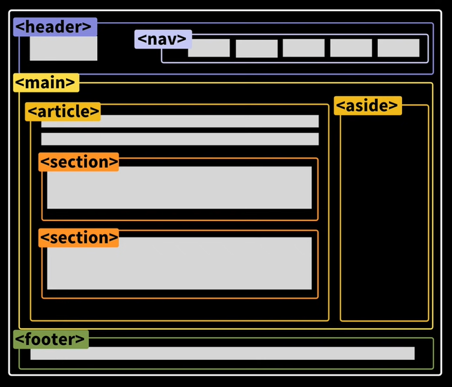

## Semantic Tags (Semantic Markup)

- HTML 태그가 특정 목적, 역할 및 의미적 가치(semantic value)를 가지는 것
- Non semantic 요소로는 div, span 등이 있으며 a, form, table 태그들도 시맨틱 태그로 볼 수 있음

### 대표적인 시맨틱 태그 목록



- header : 문서 전체나 섹션의 헤더 (머리말 부분), 웹사이트 로고나 사용자들을 위한 여러가지 메뉴가 잇는 블록
- nav : 내비게이션
- main : 중요한 컨텐츠
- aside : 사이드에 위치한 공간, 메인 콘텐츠와 관련성이 적은 콘텐츠 (광고나 페이지와 연관된 다른 링크)
- section : 문서의 일반적인 구분, 컨텐츠의 그룹을 표현
- article : 문서, 페이지, 사이트 안에서 독립적으로 구분되는 영역
- footer : 문서 전체나 섹션의 푸터 (마지막 부분), 부가적인 정보나 링크
- h1 : 제목, 타이틀

### 시맨틱 태그를 사용하는 이유

- div 태그만 쓰는 것은 좋지 않음

- 의미론적 마크업
- 개발자 및 사용자 뿐만 아니라 검색엔진 등에 의미 있는 정보의 그룹을 태그로 표현
- 단순히 구역을 나누는 것 뿐만 아니라 '의미'를 가지는 태그들을 활용하기 위한 노력
- 요소의 의미가 명확해지기 때문에 코드의 가독성을 높이고 **유지보수를 쉽게 할 수 있음 (Maintainability)** 
- **검색 엔진 최적화(SEO)**를 위해서 메타태그, 시맨틱 태그(제목, 부제목) 등을 통한 마크업을 효과적으로 활용해야함
- **웹 접근성(Accessibility)**을 높임
  - 스크린리더나 키보드를 사용해서 웹사이트를 이용할 때 시맨틱태그에 따라 읽어주는게 다르기 때문에 적절하게 사용해야 함


### 비슷하지만 다른 시맨틱 태그들

#### 이탤릭체

- `<i>` : 시각적으로만 이탤릭체, 책의 제목 또는 인용구
- `<em>` : 강조하는 이탤릭체 (스크린리더로 읽을때 강조됨)

#### 볼드체

- `<b>`: 시각적으로만 볼드체
- `<strong>`: 정말 중요하고 강조하는 볼드체

#### 목록

- `<ol>`: 순서가 있는 목록을 나타낼때 (숫자로 나타내짐)
- `<ul>`: 순서가 없는 목록을 나타낼때 (단순 목록화)
- `<dl>`: description list, 어떤 한 단어에 대해 설명이 있는 목록을 타나낼때  (정의, 설명 목록)
```html
<dl>
    <dt>HTML</dt>
    <dd>웹페이지의 골격, 문서를 만들때 사용함</dd>
    
    <dt>CSS</dt>
    <dd>HTML로 작성한 웹 문서를 예쁘게 스타일링</dd>
    
    <dt>JavaScript</dt>
    <dd>동적으로!</dd>
</dl>
```

#### 이미지

- ``: 이미지가 메인인 페이지일때 사용
- `<background>`: 이미지가 페이지 내용과 상관없고 단순히 배경 이미지일때

#### 버튼

- `<button>`: 사용자의 특정한 액션을 위해서 사용 (리뷰, 추천, 로그인, 가입 버튼)
- `<a>`: 사용자가 어디론가 이동할때 (링크)

#### 배치

- `<table>` : 데이터를 나타낼때
- css : 그리드 형식으로 나타낼때 (Flex, Grid)

### 참고

- [마크업 예시](https://9elements.com/bem-cheat-sheet/#navigation)

### Reference

- https://www.youtube.com/watch?v=T7h8O7dpJIg&list=WL&index=2&t=1s

