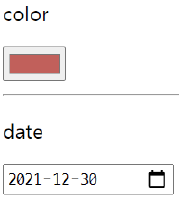

# HTML

## table

- `<thead>`, `<tbody>`, `<tfoot>` 요소 활용


- `<tr>`으로 가로줄을 구성하고 내부에는 `<th>` 혹은 `<td>`로 셀 구성


- `colspan`, `rowspan` 속성을 활용하여 병합


- `<caption>`을 통해 표 설명 또는 제목을 나타냄


### table 태그 기본 구성

- `thead`
  - `tr` > `th`
- `tbody`
  - `tr` > `td`
- `tfoot`
  - `tr` > `td`
- `caption`

```html
<table>
  <thead>
    <tr>
      <th>Header content 1</th>
      <th>Header content 2</th>
    </tr>
  </thead>
  <tfoot>
    <tr>
      <td>Footer content 1</td>
      <td>Footer content 2</td>
    </tr>
  </tfoot>
  <tbody>
    <tr>
      <td>Body content 1</td>
      <td>Body content 2</td>
    </tr>
  </tbody>
  <caption>caption 1</caption>
</table>
```

## form

- `<form>`은 정보(데이터)를 서버에 제출하기 위해 사용하는 태그
- `<form>` 기본 속성
  - `action` : form을 처리할 서버의 URL (데이터를 보낼 곳)
  - `method` : form을 제출할 때 사용할 HTTP 메서드 (GET 혹은 POST)
  - `enctype` : method가 post인 경우 데이터의 유형
    - application/x-www-form-urlencoded : 기본값
    - multipart/form-data : 파일 전송 시 (input type이 file인 경우)
    - text/plain : HTML5 디버깅용 (잘 사용되지 않음)

## input

- 다양한 타입을 가지는 입력 데이터 유형과 위젯이 제공됨
- `<input>`의 대표적인 속성
  - name : form control에 적용되는 이름 (이름/값 페어로 전송됨)
  - value : form control에 적용되는 값 (이름/값 페어로 전송됨)
  - required, readonly, autofocus, autocomplete, disabled 등

### input label

- label을 클릭하여 input 자체의 초점을 맞추거나 활성화 시킬 수 있음
  - 사용자는 선택할 수 있는 영역이 늘어나 웹/모바일(터치) 환경에서 편하게 사용할 수 있음
  - label과 input 입력의 관계가 시각적 뿐만 아니라 화면리더기에서도 label을 읽어주어 쉽게 내용을 확인할 수 있도록 함
- `<input>`에 id 속성을, `<label>`에는 for 속성을 활용하여 상호 연관 시킴


```html
<body>
  <form action="">
    username : <input type="text">
    <br>
    id : <input type="text" name="username" disabled>
    <input type="submit" value="확인">
    <br>
    id : <input type="text" name="username" required>
    <input type="submit" value="확인">
    <br>
    name : <input type="text" name="name" autofocus>
    <input type="submit" value="확인">
    <br>
    email : <input type="email" name="username">
    <br>
    password : <input type="password" name="name">
    <input type="submit" value="확인">
  </form>
  <form action="">
    <!-- username만 클릭해도 입력가능하게 함 label! -->
    <label for="username">username</label>
    <input type="email" name="username" id="username">
  </form>
  <form action="">
    <label for="mincho">민초</label>
    <input type="radio" name="is_mincho" id="mincho" value="1">
    <label for="notmincho">반민초</label>
    <input type="radio" name="is_mincho" id="notmincho" value="0">
  </form>
</body>
```


```html
<body>
  <h1>Form 활용 실습</h1>
	<form action="">
	<!-- autofocus 및 label 확인 -->
	<div class="input-group">
	  <label for="username">아이디</label>
	</div>
	<input type="text" name="username" id="username" autofocus>
        
	<!-- disabled 및 value 확인 -->
	<div class="input-group">
	  <label for="name">이름</label>
	</div>
	<input type="text" name="name" value="홍길동" id="name" disabled>
        
	<!-- label 확인 -->
	<div class="input-group">
	  <label for="agreement">개인정보 수집에 동의합니다.</label>
	</div>
	<input type="checkbox" name="agreement" id="agreement">
	<div class="input-group">
	  <label>최종 제출을 확인합니다.</label>
	</div>
	<input type="checkbox">
  </form>
  <input type="submit" value="제출">
</body>
```

### input 유형 - 일반

- 일반적으로 입력을 받기 위해 제공되며 타입별로 HTML기본 검증 혹은 추가 속성을 활용할 수 있음


- text : 일반 텍스트 입력
- password : 입력 시 값이 보이지 않고 문자를 특수기호(*)로 표현
- email : 이메일 형식이 아닌 경우 form 제출 불가
- number : min, max, step 속성을 활용하여 숫자 범위 설정 가능
- file : accept 속성을 활용하여 파일 타입 지정 가능

### input 유형 - 항목 중 선택

- 일반적으로 label 태그와 함께 사용하여 선택 항목을 작성
- 동일 항목에 대하여는 name을 지정하고 선택된 항목에 대한 value를 지정해야함
  - checkbox : 다중 선택
  - radio : 단일 선택
  - 

```html
<div>
  <p>checkbox</p>
  <input id="html" type="checkbox" name="language" value="html">
  <label for="html">HTML</label>
  <input id="python" type="checkbox" name="language" value="python">
  <label for="python">파이썬</label>
  <input id="python" type="checkbox" name="language" value="java">
  <label for="java">자바</label>
  <hr>
</div>
```

### input 유형 - 기타

- 다양한 종류의 input을 위한 picker를 제공
  - color : color picker
  - date : date picker
  - 
- hidden input을 활용하여 사용자 입력을 받지 않고 서버에 전송되어야 하는 값을 설정
  - hidden : 사용자에게 보이지 않는 input

