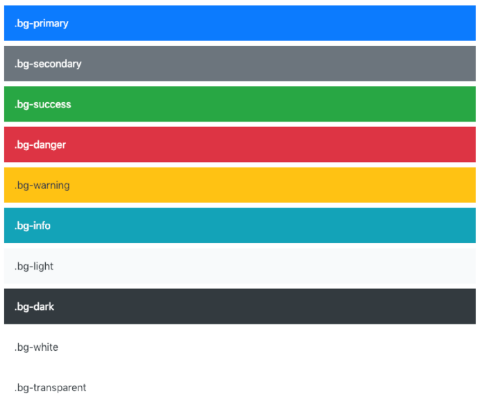
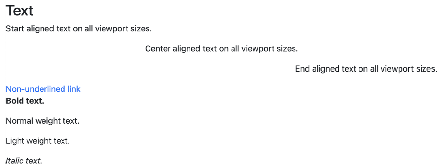
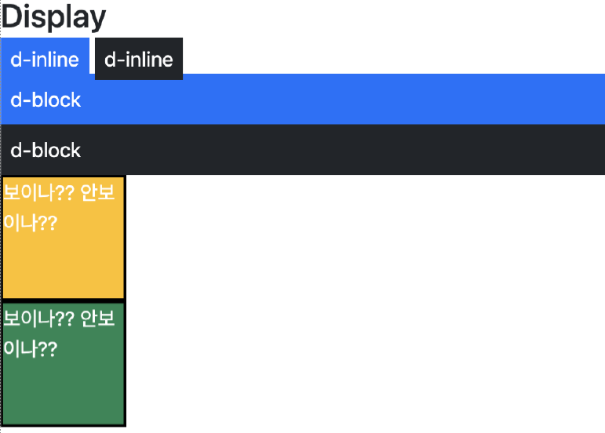
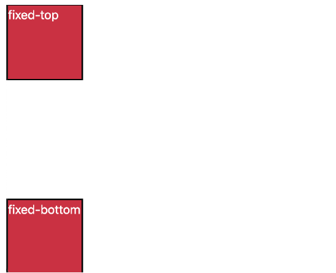

# Bootstrap

- [Bootstrap Docs](https://getbootstrap.com/docs/5.2/getting-started/introduction/)
- [Bootstrap icons](https://icons.getbootstrap.com/)
- [animate](https://animate.style/)

## CDN

> Content Delivery(Distribution) Network

- 컨텐츠(CSS, JS, Image, Text 등)을 효율적으로 전달하기 위해 여러 노드에 가진 네트워크에 데이터를 제공하는 시스템
- 개별 end-user의 가까운 서버를 통해 빠르게 전달 가능(지리적 이점)
- 외부 서버를 활용함으로써 본인 서버의 부하가 적어짐

### Bootstrap CDN

```html
<!-- CSS only -->
<link href="https://cdn.jsdelivr.net/npm/bootstrap@5.2.2/dist/css/bootstrap.min.css" rel="stylesheet" integrity="sha384-Zenh87qX5JnK2Jl0vWa8Ck2rdkQ2Bzep5IDxbcnCeuOxjzrPF/et3URy9Bv1WTRi" crossorigin="anonymous">

<!-- JavaScript Bundle with Popper -->
<script src="https://cdn.jsdelivr.net/npm/bootstrap@5.2.2/dist/js/bootstrap.bundle.min.js" integrity="sha384-OERcA2EqjJCMA+/3y+gxIOqMEjwtxJY7qPCqsdltbNJuaOe923+mo//f6V8Qbsw3" crossorigin="anonymous"></script>
<script src="https://cdn.jsdelivr.net/npm/@popperjs/core@2.11.6/dist/umd/popper.min.js" integrity="sha384-oBqDVmMz9ATKxIep9tiCxS/Z9fNfEXiDAYTujMAeBAsjFuCZSmKbSSUnQlmh/jp3" crossorigin="anonymous"></script>
```

## Spacing

### Margin & Padding

- m
  - for classes that set margin
- p
  - for classes that set padding

- t
  - for classes that set margin-top or padding-top
  - `mt`, `pt`
- b
  - for classes that set margin-bottom or padding-bottom
  - `mb`, `pb`
- s
  - (start) for classes that set margin-left or padding-left in LTR
  - `ms`,` ps`
- e
  - (end) for classes that set margin-right or padding-right in LTR
  - `me`, `pe`
- x
  - for classes that set both left and right
  - `mx`, `px`
- y
  - for classes that set both top and bottom
  - `my`, `py`
- blank
  - for classes that set a margin or padding on all 4 sides of the element
  - `m`, `p`

- 0, 1, 2, 3, 4, 5, auto
  - size
  - `mt-5`, `p-auto`
  - `mx-auto` : 블록 요소 수평 중앙 정렬 가로 가운데 정렬

| class name | rem  |  px  |
| :--------: | :--: | :--: |
|    m-1     | 0.25 |  4   |
|    m-2     | 0.5  |  8   |
|    m-3     |  1   |  16  |
|    m-4     | 1.5  |  24  |
|    m-5     |  3   |  48  |

## Color



```html
<div class="bg-primary">파란 배경색</div>
<div class="bg-secondary">회색 배경색</div>
<div class="bg-danger">빨간 배경색</div>
<p class="text-success">초록 글씨</p>
<p class="text-danger">초록 글씨</p>
```

## Text



```html
<p class="text-start">Start aligned text on all viewport sizes.</p>
<p class="text-center">Center aligned text on all viewport sizes.</p>
<p class="text-end">End aligned text on all viewport sizes.</p>
<a href="#" class="text-decoration-none">Non-underlined link</a>
<p class="fw-bold">Bold text.</p>
<p class="fw-normal">Normal weight text.</p>
<p class="fw-light">Light weight text.</p>
<p class="fst-italic">Italic text.</p>
```

## Display



```html
<h2>Display</h2>
<div class="d-inline p-2 bg-primary text-white">d-inline</div>
<div class="d-inline p-2 bg-dark text-white">d-inline</div>
<div class="d-block p-2 bg-dark text-white">d-inline</div>
<div class="d-block p-2 bg-primary text-white">d-inline</div>
<div class="box bg-warning d-sm-none d-md-block">보이나?? 안보이나??</div>
<div class="box bg-success d-md-none d-xl-block">보이나?? 안보이나??</div>
```

## Position



```html
<div class="box fixed-top">fixed-top</div>
<div class="box fixed-bottom">fixed-bottom</div>
```

## Components

- Bootstrap의 다양한 UI요소를 활용할 수 있음
- 아래 Components 탭 및 검색으로 원하는 UI 요소를 찾을 수 있음
- 기본 제공된 Components를 변환해 활용

### Buttons

- 클릭을 했을 때 어떤 동작이 일어나도록 하는 요소

### Dropdowns

- dropdown, dropdown-menu, dropdown-item 클래스를 활용해 옵션 메뉴를 만들 수 있음

### Form

- form-control 클래스를 사용해 input 및 form 태그를 스타일링 할 수 있음

### Navbar

- navbar 클래스로 네비게이션 바 제작

### Carousel

- 컨텐츠(사진)을 순환시키기 위한 슬라이드 쇼

### Modal

- 사용자와 상호작용 하기 위해서 사용하며 긴급상황을 알리는데 주로 사용
- 현재 열려있는 페이지 위에 또 다른 레이어를 띄움 (팝업)
- 페이지를 이동하면 자연스럽게 사라짐 (옵션에 따라 다르지만 제거를 하지 않고도 배경 클릭시 사라짐)

- Modal은 자바스크립트를 활용하며 반드시 target과 id가 일치되어야 함