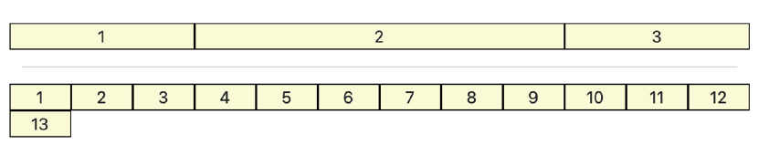
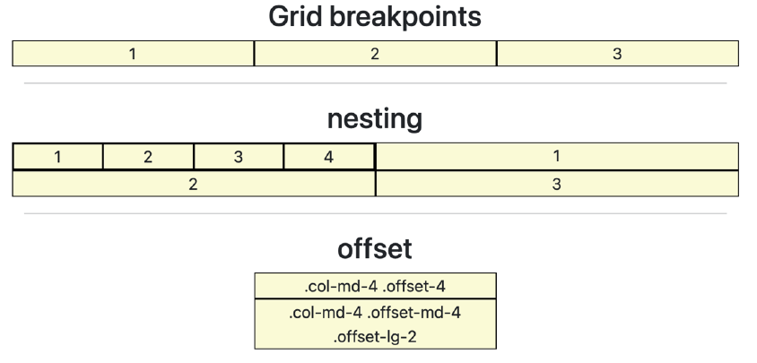
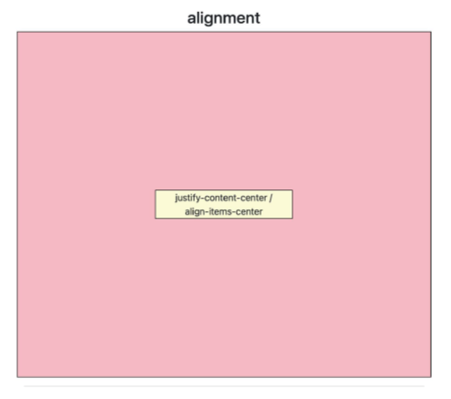
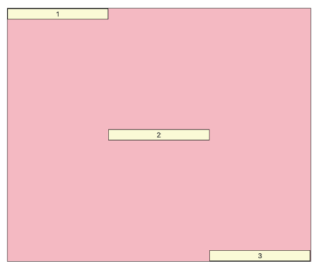

# Grid System

- 반응형 디자인
- 일관성있는 요소 배치

- 기본 요소
  - Column : 실제 컨텐츠를 포함하는 부분
  - Gutter : 칼럼과 칼럼 사이의 공간 (사이 간격)
  - Container : Column들을 담고 있는 공간

# Bootstrap Grid system

- [Bootstrap Grid System](https://getbootstrap.com/docs/5.2/layout/grid/)

- flexbox로 제작됨
- container, rows, column으로 컨텐츠를 배치하고 정렬
- 12개의 column
- 6개의 grid breakpoints

## 연습


```html
<div class="container">
  <h2 class="text-center">column</h2>
  <div class="row">
	<div class="col">1</div>
	<div class="col">2</div>
	<div class="col">3</div>
  </div>
</div>
```



```html
<div class="container">
  <div class="row">
    <div class="box col-3">1</div>
    <div class="box col-6">2</div>
  <div class="box col-3">3</div>
  </div>

  <div class="row">
    <div class="box col-1">1</div>
    <div class="box col-1">2</div>
    <div class="box col-1">3</div>
    <div class="box col-1">4</div>
    <div class="box col-1">5</div>
    <div class="box col-1">6</div>
    <div class="box col-1">7</div>
    <div class="box col-1">8</div>
    <div class="box col-1">9</div>
    <div class="box col-1">10</div>
    <div class="box col-1">11</div>
    <div class="box col-1">12</div>
    <div class="box col-1">13</div>
  </div>
</div>
```


```html
<div class="container">
  <div class="row">
	<div class="box col-9">col-9</div>
	<div class="box col-4">col-4</div>
	<div class="box col-3">col-3</div>
  </div>
</div>
```



```html
<div class="container">
  <h2 class="text-center">Grid breakpoints</h2>
  <div class="row">
	<div class="box col-sm-8 col-md-4 col-lg-5">1</div>
	<div class="box col-8 col-sm-2 col-md-4 col-lg-2">2</div>
	<div class="box col-2 col-sm-2 col-md-4 col-lg-5">3</div>
  </div>
  <hr>
  <h2 class="text-center">nesting</h2>
  <div class="row">
	<div class="box col-6">
	  <div class="row">
		<div class="box col-3">1</div>
		<div class="box col-3">2</div>
		<div class="box col-3">3</div>
		<div class="box col-3">4</div>
	  </div>
	</div>
	<div class="box col-6">1</div>
	<div class="box col-6">2</div>
	<div class="box col-6">3</div>
  </div>
  <hr>
  <h2 class="text-center">offset</h2>
  <div class="row">
	<div class="box col-md-4 offset-4">.col-md-4 .offset-4</div>
	<div class="box col-md-4 offset-md-4 offset-lg-2">.col-md-4 .offset-md-4 .offset-lg-2</div>
  </div>
  <hr>
</div>
```



```html
<div class="container">
  <h2 class="text-center">alignment</h2>
  <div class="row parent justify-content-center align-items-center">
	<div class="box col-4">justify-content-center / align-items-center</div>
  </div>
  <hr>
</div>
```



```html
<div class="container">
  <div class="row parent">
	<div class="box col-4 align-self-start">1</div>
	<div class="box col-4 align-self-center">2</div>
	<div class="box col-4 align-self-end">3</div>
  </div>
</div>
```

