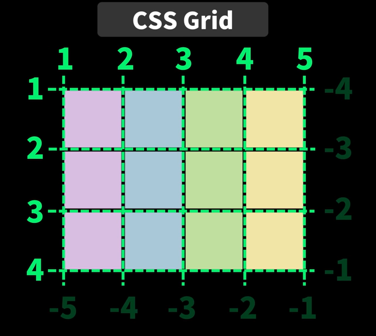

# CSS Layout

## flex

- 기본적으로 row direction (가로줄로 배치)

- column 세로줄로 배치

- wrap 줄바꿈해서 배치

## grid

- column과 row 2차원으로 아이템 정렬 가능

```css
/* grid 부모 요소 */
display: grid
grid-template-columns
grid-template-rows
grid-template-areas
grid-gap
grid-column-gap
grid-row-gap
```

- % : 반응형으로 만들때
- fr : 반응형으로 만들때 단위
- `grid-auto-rows` : 각 줄의 높이 지정
- `grid-auto-rows: minmax(150px, auto)`
  - 높이 최소 150px, 아이템에 따라 높이 늘어남

```css
/* grid cell 자식 요소 */

grid-column: 시작할 줄 번호 / 끝나는 줄번호
grid-column-startt: 시작할 줄 번호
grid-column-end: 끝나는 줄번호

grid-row: 시작할 줄 번호 / 끝나는 줄번호
grid-row-start: 시작할 줄 번호
grid-row-end: 끝나는 줄번호

grid-area
```

- grid-column-start, grid-column-end: 시작과 끝 줄 지정



### Reference

- https://www.youtube.com/watch?v=nxi1EXmPHRs