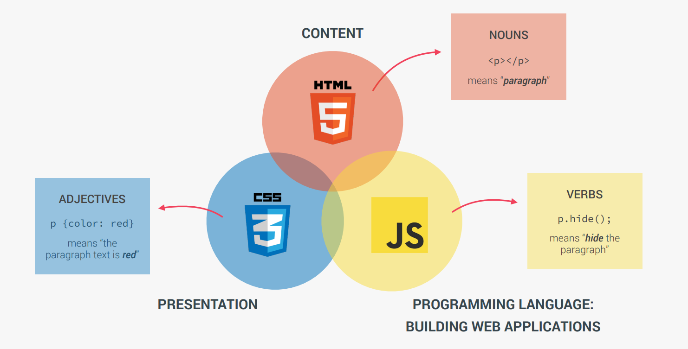

# JavaScript

> high-level, object-oriented, multi-paradigm programming language

- instruct computer to do things
- dont have to worry about complex stuff like memory management
- based on objects, for storing most kinds of data
- We can use different styles of programming

## The Role of JS in web development



- html - content
- css - presentation
- js - programming langauge (building web applications)


Js 파일과 html 연결하기

인라인 스크립트의 유일한 장점은 다른 파일을 로드할 필요가 없는것 (html 만 로드하면 되니까)

하지만 웹사이트와 자바스크립트 로직을 분리하기에 / 유지보수하기에 아주 안좋으므로 js파일을 따로 만들기

```html
<script src="script.js"></script>
```

 