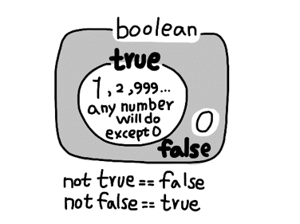

# Python 기초

## 컴퓨터 프로그래밍 언어

### 컴퓨터(Computer)

> Caculation + Remember

### 프로그래밍(programming)

> 명령어의 모음(집합)

### 언어

> 자신의 생각을 나타내고 전달하기 위해 사용하는 체계
>
> 문법적으로 맞는 말의 집합 -> 컴퓨터에게 명령하는 말

- 선언적 지식(declarative knowledge) : 사실에 대한 내용
- 명령적 지식(imperative knowledge) : How-to

## 1. Python 이란?

- Easy to learn
  - 다른 프로그래밍 언어보다 문법이 간단하면서도 엄격하지 않음
    - 예시 : 변수에 별도의 타입 지정이 필요없음 (동적 타이핑 언어)
  - 문법 표현이 매우 간결하여 프로그래밍 경험이 없어도 짧은 시간 내에 마스터 할 수 있음
- Expressive Language
  - 같은 작업에 대해서도 C나 자바로 작성할 때보다 더 간결하게 작성 가능
  - 크로스 플랫폼 언어
    - Windows, macOS, Linux, Unix 등 다양한 운영체제에서 실행 가능
- 인터프리터 언어(Interpreter)
  - 소스코드를 기계어로 변환하는 컴파일 과정없이 바로 실행 가능
  - 코드를 대화하듯 한 줄 입력하고 실행한 후, 바로 확인할 수 있음
- 객체 지향 프로그래밍(Object Oriented Programming)
  - 파이썬은 객체지향 언어이며, 모든 것이 객체로 구현되어 있음
    - 객체(object) : 숫자, 문자, 클래스 등 값을 가지고 있는 모든 어떠한 것

## 2. Python 개발 환경

파이썬 기본 인터프리터 : IDLE

- IDLE (Intergrated Development and Learning Environment)
  - 내장 프로그램으로 파이썬 설치 시 기본적으로 설치 -> 인터프리터가 대화형 모드로 동작함
    - 여러 줄의 코드가 작성되는 경우 보조 프롬프트가 사용됨
    - 프롬프트에 코드를 작성하면 해당 코드가 실행됨
  - Python이 설치된 환경에서는 기본적으로 활용 가능하나 디버깅 및 코드 편집, 반복 실행이 어려움

## 3. Python 기초 문법

### 코드 스타일 가이드

- 코드를 ''어떻게 작성할지''에 대한 가이드라인

- 파이썬에서 제안하는 스타일 가이드 : [PEP8](https://peps.python.org/pep-0008/)
  
- 기업, 오픈소스 등에서 사용되는 스타일 가이드 : [Google Style guide](https://google.github.io/styleguide/pyguide.html)

### 들여쓰기 (Identation)

- Space Sensitive
  - 문장을 구분할 때, 들여쓰기(indentation)를 사용
  - 들여쓰기 할때는 띄어쓰기 4칸 혹은 tab 1번

### 변수 (Variable)

> 컴퓨터 메모리 어딘가에 저장되어 있는 객체를 참조하기 위해 사용되는 이름

- 객체 (object) : 숫자, 문자, 클래스 등 값을 가지고 있는 모든 것
- 파이썬은 객체지향 언어이며, 모든 것이 객체로 구현되어 있음

- 동일변수에 다른 객체를 언제든 할당할 수 있기 때문에, 즉 참조하는 객체가 바뀔 수 있기 때문에 '변수'라고 불림
- 변수는 할당 연산자(=)를 통해 값을 할당 (assignment)
- `type()` : 변수에 할당된 값의 타입
- `id() `: 변수에 할당된 값(객체)의 고유한 identity 값이며, 메모리주소
- 변수 연산 가능

```python
s = '파이썬'
print(s * 3)
print(s + 'is fun')

# 파이썬파이썬파이썬
# 파이썬 is fun
```

```python
# 연습 문제
# x = 10, y = 20 일 때, 각각 값을 바꿔서 저장하는 코드를 작성하시오.

x, y = 10, 20

# 1
tmp = x
x = y
y = tmp
print(x,y)
# 2
y, x = x, y
print(x, y)
```

### 식별자 (Identifiers)

- 파이썬 객체(변수, 함수, 모듈, 클래스 등)를 식별하는데 사용하는 이름(name)
- 규칙
  - 식별자의 이름은 영문 알파벳, 언더스코어(_), 숫자로 구성
  - 첫 글자에 숫자 안됨
  - 길이제한 없음 대소문자 구별함
- 내장함수나 모듈 등의 이름으로도 만들면 안됨
  - 기존의 이름에 다른 값을 할당하게 되므로 더 이상 동작하지 않음
- 예약어 사용 불가

### 사용자 입력

- input([prompt])
  - 사용자로부터 값을 입력받을 수 있는 내장함수
  - 항상 문자열의 형태로 반환


``` python
name = input('이름을 입력해주세요 : ')
print(name)
# 이름을 입력해주세요 : 파이썬
type(name)
# str
```

### 주석(Comment)

- 코드에 대한 설명
  - 중요한 점이나 다시 확인해야 하는 부분 표시
  - 컴퓨터는 주석을 인식하지 않음 사용자만을 위한 것
- 가장 중요한 습관
  - 개발자에게 주석을 작성하는 습관은 매우 중요
  - 쉬운 이해와 코드의 분석 및 수정 용이
    - 주석은 코드 실행에 영향을 미치지 않을 뿐만 아니라 프로그램의 속도를 느리게 하지 않고 용량을 늘리지 않음

- 한 줄 주석
  - 주석으로 처리될 내용 앞에 `#` 입력
  - 단축키 `Ctrl + /`

## 4. Python 기본 자료형 (Datatype)

### 자료형 분류

#### 불린형 (Boolean Type)

- True / False 값을 가진 타입
- 비교 / 논리 연산 수행
- `bool()` 함수
- 0, 0.0, (), []. {}, ", None 을 False로 변환



이미지 출처- CodeUp

#### 수치형 (Numeric Type)

- int (정수, integer)

  - 매우 큰 수를 나타낼때에도 오버플로우 발생하지 않음
- float (부동소수점, 실수, floating point number)

  - 부동 소수점

    - 값을 비교하는 과정에서 실수인 경우 주의할 것
    - ```py
      3.14 - 3.02 != 0.12
      # 0.1200000000000001 임을 유의
      ```

    - 매우 작은 수보다 작은지를 확인하거나 math 모듈 활용

    - ```python
      #1 임의의 작은 수와 비교
      abs(a - b) <= 1e-10
      
      #2 math 모듈 활용
      import math
      math.isclose(a, b)
      ```
- complex (복소수, complex number)

#### 문자열 (String Type)

- 모든 문자는 str타입
- 작은 따옴표나 큰 따옴표 이용하여 표기

```python
print("문자열 안에 '작은따옴표'를 사용하려면 큰 따옴표 사용")
print('문자열 안에 "큰따옴표"를 사용하려면 작은 따옴표 사용')
print('''문자열 안에 작은따옴표나 큰따옴표 사용시 삼중따옴표''')
```

- 인덱싱, 슬라이싱 가능

```python
str = abcdefghi

s[1] -> 'b'
s[2:5] -> 'cde'
s[2:5:2] -> 'ce'
s[5:2:-1] -> 'fed'
s[:3] -> 'abc'
s[5:] -> 'fghi'
s[::] -> 'abcdefghi'
s[::-1] -> 'ihgfedcba'
```

- 결합, 반복 포함 가능

```python
# 결합(Concatenation)
'hello, ' + 'python!'
#'hello, python!'

# 반복(Repetition)
'hi!' * 3
# 'hi!hi!hi!'

# 포함(Membership)
'a' in 'apple'
# True
'app' in 'apple'
# True
'b' in 'apple'
# False
```

- Escape sequence ()

  | 예약문자 | 내용(의미)       |
  | -------- | ---------------- |
  | \n       | 줄 바꿈          |
  | \t       | 탭               |
  | \r       | 캐리지리턴       |
  | \0       | 널(NULL)         |
  | \        | `\` 출력         |
  | '        | 단일인용부호 `'` |
  | "        | 이중인용부호 `"` |

- String Interplation 

  - 문자열을 변수를 활용하여 만드는 법

```python
## %-formatting
## f-string

name = 'Kim'
score = 4.5
pi = 3.141592

print('Hello, %s' % name)
print('내 성적은 %d' % score)
print('내 성적은 %f' % score)
print(f'Hello, {name}! 성적은 {score})
print(f'원주율은 {pi:.3}. 반지름이 2일때 원의 넓이는 {pi*2*2}')
      
# Hello, Kim
# 내 성적은 4
# 내 성적은 4.500000
# Hello, Kim! 성적은 4.5
# '원주율은 3.14. 반지름이 2일때 원의 넓이는 12.566368'
```

- Immutable (변경 불가능)

```python
a = 'my string?'
a[-1] = '!'

#TypeError
```

- Iterable (반복 가능)

```python
a = '123'
for char in a:
    print(char)
```

#### None

- 파이썬에서 값이 없음을 표현하기 위해 None 타입이 존재함
- 일반적으로 반환 값이 없는 함수에서 사용하기도 함

```python
print(type(None))
# <class 'NonType'>
a = None
print(a)
# None
```

### 연산자 (Operator)

#### 논리 연산자 (Logical Operator)

> 논리식을 판단하여 True False를 반환함

| 연산자  |                내용                 |
| :-----: | :---------------------------------: |
| A and B |   A 와 B 모두 True 시, True 반환    |
| A or B  |   A와 B 모두 False 시, False 반환   |
|   Not   | True를 False로, False를 True로 반환 |

#### 산술 연산자 (Arithmetic Operator)

> 기본적인 사칙연산 및 수식 계산

| 연산자 |   내용   |
| :----: | :------: |
|   +    |   덧셈   |
|   -    |   뺄셈   |
|   *    |   곱셈   |
|   %    |  나머지  |
|   /    |  나눗셈  |
|   //   |    몫    |
|   **   | 거듭제곱 |

#### 복합 연산자 (In-place Operator)

| 연산자  |    내용    |
| :-----: | :--------: |
| a += b  | a = a + b  |
| a -= b  | a = a - b  |
| a *= b  | a = a * b  |
| a /= b  | a = a / b  |
| a //= b | a = a // b |
| a %= b  | a = a % b  |
| a **= b | a = a ** b |

#### 비교 연산자 (Comparison Operator)

> 값을 비교하여 True/False 반환

- <, <=, >, >=, ==, !==, is, is not 

```python
# 아래는 참일까? 거짓일까?
3.14 - 3.02 == 0.12

3.14 - 3.02
# 0.12000000000001
```

### 형 변환 (Typecasting)

#### 자료형 변환 (Typecasting)

- 파이썬에서 데이터 형태는 서로 변환할 수 있음

  - 암시적 형 변환 (Implict Typecasting)

    - 사용자가 의도하지 않고 파이썬 내부적으로 자료형을 변환하는 경우 (bool, int, float, complex)

    ```python
    True + 3
    # 4
    3 + 5.0
    # 8.0
    3 + 4j +5
    # (8+4j)
    ```

  - 명시적 형 변환(Explicit Typecasting)

    - 사용자가 특정 함수를 활용하여 의도적으로 자료형을 반환하는 경우

    ```python
    # 문자열은 암시적 타입 변환이 되지않음
    '3' + 4
    # TypeError
    
    # 명시적 타입 변환이 필요함
    int('3') + 4
    # 7
    ```

### 컨테이너 (Container)

> 여러개의 값을 담을 수 있는 것(객체), 서로 다른 자료형을 저장할 수 있음 (list, tuple 등)

- 컨테이너의 분류

  - 순서가 있는 데이터(Ordered), 순서가 없는 데이터(Unordered)

  - 순서가 있다 != 정렬되어 있다

  - 시퀀스

    - 문자열 (immutable) : 문자들의 나열


    - 리스트 (mutable) : 변경 가능한 값들의 나열


    - 튜플 (immutable) : 변경 불가능한 값들의 나열


    - 레인지 (immutable) : 숫자의 나열


  - 컬렉션/비시퀀스

    - 세트 (matable) : 유일한 값들의 모음

    - 딕셔너리 (mutable) : 키-값들의 모음

### 시퀀스형 컨테이너 (Sequence Container)

#### 시퀀스형 주요 연산자

|    연산    |                   결과                   |
| :--------: | :--------------------------------------: |
|    s[i]    |     s의 i번째 항목 (0에서부터 시작)      |
|   s[i:j]   |         s의 i에서 j까지 슬라이스         |
|  s[i:j:k]  |             s의 i에서 j까지              |
|   s + t    |             s와 t 이어붙이기             |
|   s * n    |               s를 n번 출력               |
|   x in s   | s의 항목 중 x가 있으면 True 없으면 False |
| x not in s | s의 항목 중 x가 있으면 False 없으면 True |
|   len(s)   |                 s의 길이                 |
|   min(s)   |            s에서 가장 작은 값            |
|   max(s)   |             s에서 가장 큰 값             |

#### 리스트 (List)

- 변경 가능한 값들의 나열된 자료형
- 순서를 가지며, 서로 다른 타입의 요소를 가질 수 있음
- 변경 가능하며(mutable), 반복 가능함(iterable)
- 항상 대괄호 형태로 정의하며, 요소는 콤마로 구분
- `[]` 또는 `list()`로 생성
- 순서가 있는 시퀀스로, 인덱스 사용 가능 `list[i]`

```python
# 생성
my_list = []
another_list = list()
type(my_list)
# <class 'list'>
type(another_list)
# <class 'list'>

# 값 접근
a = [1, 2, 3]
print(a[0])
# 1

# 값 변경
a[0] = '1'
print(a)
#['1', 2, 3]
```

- `.append()` : 값 추가 (값)
- `.pop()`: 값 삭제 (인덱스)

```python
even_numbers = [2, 4, 6, 8]
even_numbers.append(10)
even_numbers
# [2, 4, 6, 8, 10]

even_numbers = [2, 4, 6, 8]
even_numbers.pop(0)
even_numbers
# [4, 6, 8]
```

```python
# 예제
boxes = ['apple', 'banana']

len(boxes)
# 2
boxes[1]
# 'banana'
boxes[1][0]
# 'b'
```

#### 튜플 (Tuple)

- 불변한 값들의 나열
- 순서를 가지며 서로 다른 타입의 요소를 가질 수 있음
- 변경 불가능하며(immutable), 반복 가능함(iterable)
- 항상 소괄호 형태로 정의하며, 요소는 콤마로 구분 예> (0, 1, 3)
- `()` 또는 `tuple()`을 통해 생성
- 값에 대한 접근은 리스트와 동일하게 인덱스로 접근
  - 값 변경은 불가능하여 추가/삭제도 불가능

```python
# 값 접근
a = (1, 2, 3, 1)
a[1]

# 값 변경 -> 불가능!
a[1] = '3'
# TypeError
```

#### 레인지 (Range)

- `range(n=0, m, s=1)`

- 숫자의 시퀀스를 나타내기 위해 사용

  - 기본형 : `range(n)`
    - 0부터 n-1까지 숫자의 시퀀스
  - 범위 지정 : `range(n, m)`
    - n부터 m-1까지 숫자의 시퀀스
  - 범위 및 스텝 지정 : range(n, m ,s)
    - n부터 m-1까지 s만큼 증가시키며 숫자의 시퀀스

  ---> 슬라이싱이랑 닮음

- 변경 불가능(immutable), 반복 가능(iterable)

### 비시퀀스형 컨테이너 (Associative Container)

#### 셋 (Set)

- 유일한 값들의 모음 (collection)
- 순서가 없고 중복값 없음 **---> 중복값 제거 시 유리**
- 변경 가능(mutable), 반복 가능(iterable)

- 중괄호`{}` 혹은 set() 으로 생성
  - 빈 Set 생성 시, set() 반드시 사용

- 순서가 없어 별도의 값에 접근할 수 없음

- `.add(값)` : 값 추가
- ` .remove(값)` : 값 삭제
- `.update(값1, 값2, 값3 ...)` : 값 여러개 추가

```python
# 중복제거 활용 예시
locations = ['서울','서울','대구','제주','부산','부산','광주','인천']
print(set(locations))

# {'부산','인천','서울','대구','제주','광주'}
```

#### 딕셔너리 (Dictionary)

- 키 - 값 (key - value) 쌍으로 이뤄진 모음 (collection)
  - 키 (key)
    - 불변 자료형(str, int, float, bool, tuple, range 등)만 가능 (list, dictionary 등은 불가능함)
  - 값 (values)
    - 어떤 형태든 가능
- 키와 값은 `:` 으로 구분되고 개별요소는 `.`로 구분됨
- 변경 가능(mutable), 반복 가능(iterable)
  - 딕셔너리는 반복 시 key가 반환됨


- key에 리스트를 넣는 경우는 없고 value에 리스트를 넣는 경우는 많음

- 순서가 없음
- `my_dict['key값']` -----> `value` 출력됨

- 키와 값의 쌍을 추가할 수 있으며 이미 해당하는 키가 있다면 값이 변경됨

```python
students = {'홍길동': 100, '김철수': 90}
students['홍길동'] = 80
# {'홍길동': 80, '김철수': 90}
students['박영희'] = 95
# {'홍길동': 80, '김철수': 90, '박영희': 95}
```

- `.pop(key)` : 키-값 삭제

```python
students = {'홍길동': 100, '김철수': 90}
students.pop('홍길동')
# {'김철수': 90}

# 키가 없는 경우 : KeyError
```

코딩폰트 - D2Coding, hack

